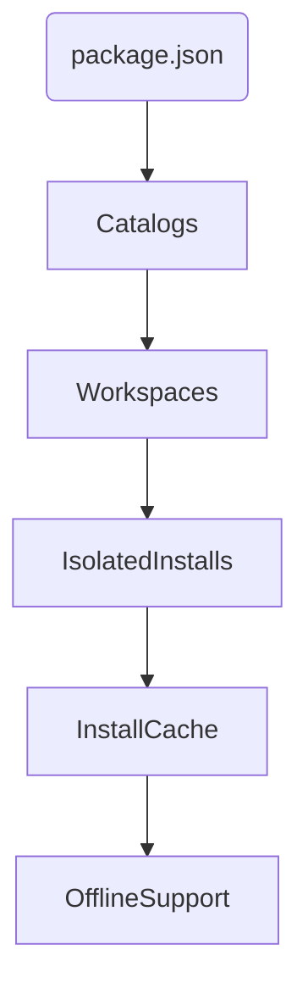

# Bun Package Manager vs npm (11) \& pnpm (10)

## TL;DR

Bun is a new, blazing fast package manager/runtime for JavaScript that seriously reduces install and test times, has smart monorepo/lockfile tooling, built-in testing, aggressive dependency isolation, migration support for npm/pnpm/yarn, cache-first and offline features (in beta), security scanning, and release/build features. *If you need maximum performance, atomic workspace installs, or want fewer moving parts (runtime, testing, dependency management, bundling all-in-one), Bun is genuinely exciting.* The latest npm and pnpm are mature and feature-rich, but lag in sheer raw speed and default isolation behavior. There are misconceptions: Bun is not just a faster npm—it's a fundamentally different, integrated toolchain. It drops some old npm behaviors and is still evolving.

> Official info: https://bun.com, blog: https://bun.com/blog/bun-v1.3, GitHub: https://github.com/oven-sh/bun, comparison: https://betterstack.com/community/guides/scaling-nodejs/nodejs-vs-deno-vs-bun/[^1][^2][^3][^4][^5][^6]

***

## Monorepo Tooling

- Bun 1.3 adds "catalogs" to centralize version management—define dependency versions once in the root and reference with `"catalog:"` from any workspace. Inspired by pnpm's version pinning. Super useful for atomic upgrades in big repos.
- Bun defaults to *isolated installs* for workspaces (no flat node_modules, every package only gets its own declared deps). npm/pnpm use hoisting/flat structure by default, which can lead to implicit dependency access.
- Supports workspace glob patterns in package.json just like npm and Yarn Berry; pnpm requires `pnpm-workspace.yaml`.[^2][^7]

```jsonc
// bun's root package.json for monorepo
{
  "workspaces": ["apps/*", "packages/*"],
  "catalog": {
    "react": "^18.0.0",
    "typescript": "^5.0.0"
  }
}
```

```jsonc
// workspace dependency reference
{
  "dependencies": {
    "react": "catalog:"
  }
}
```

- Bun can migrate existing pnpm/yarn lockfiles for frictionless adoption.[^2]

***

## Unit Tests

- Bun has a built-in *Jest-compatible* test runner (write tests with Jest syntax, blazing fast, minimal config). Run with `bun test`.
- npm and pnpm require external test libraries (Jest/Mocha). All of them support TypeScript, but Bun doesn't need extra config for TypeScript/JSX tests.[^4]

```ts
// test/example.test.ts
describe("math utils", () => {
  it("adds numbers", () => {
    expect(1 + 2).toBe(3);
  });
});
```

```bash
bun test
# Comments: No config, runs instantly.
```


***

## Dependency Management

- Bun reads npm-style package.json, supports all registry types, can use git/tarball urls, supports peer/dev/prod deps.[^5]
- Unique: "trustedDependencies" allow-lists, built-in security scanning API (with Socket integration), and interactive security warnings before install.
- Lockfile migration supported; Bun can convert your old yarn.lock/pnpm-lock.yaml seamlessly.[^2]

```toml
# bunfig.toml (for security scanner)
[install.security]
scanner = "@socketsecurity/bun-security-scanner"
```


***

## Installation Cache \& Offline Support

- Bun stores packages in a global cache and checks cache before re-downloading. Symlinks packages from cache—faster than pnpm's global store.[^5]
- True offline/zero-installs (like Yarn v2 "zero installs") is possible via a vendored `.bun/cache` folder—feature is available and actively discussed, with configurable cache directories.[^8]

```bash
bun install --cache-only
# uses only local/global cache, skips registry fetch
```


***

## Performance

- Real benchmarks: Bun is *10x faster* than npm and pnpm for installs in large projects. HTTP/server throughput: Bun does 52,000 req/sec versus Node’s 13,000.[^9][^6]
- Symlinks, no postinstall spam, minimal disk IO, native system calls for cache use.
- Cool touch: Hot reloading and cross-platform executables with Bun’s bundler.[^10]

***

## Release Tools

- Bun has a full test/build/release pipeline; you can compile both frontend/backend into one executable, minimize, and build programmatically.
- Npm and pnpm rely on external tools for bundling and release—mostly use scripts and third-party CLIs.[^10]

```ts
// programmatic bundling with Bun
import { build } from "bun";
await build({
  entrypoints: ["src/index.ts"],
  outdir: "./dist",
  minify: true,
  compile: true
});
```


***

## Unique Features

- Integrated test runner (Jest syntax, instant speed)
- Catalogs for locked monorepo versioning
- Security scanner API (real-time CVE/license/fake-package detection)
- Programmatic bundler, cross-platform executable builder
- Fully isolated installs (default for workspaces, avoids the npm/pnpm hoisting trap)
- Migration tool for lockfiles
- Used as runtime/PM even in plain Node.js projects[^10][^5][^2]

***

## Special Requirements \& Restrictions

- Bun runs best on macOS, Linux, Windows via WSL—native support expanding.[^5]
- Not all Node.js APIs/workflow support is 100%—edge cases may break, especially with sophisticated legacy code or exotic `postinstall` scripts.
- "trustedDependencies" is unique to Bun; not all npm scripts are supported.[^2][^5]

***

## Areas of Application

- Fast monorepo management, CI/CD pipelines, cross-platform builds, frontend/backend combos, fullstack projects.
- Performance-centric Node.js apps, TypeScript/JSX codebases.
- Security-sensitive environments.

***

## Restrictions \& Misconceptions

- *Not all npm features are supported*.
- Not just faster npm—integrated tooling replaces piecemeal workflow.
- Edge: Some large, deeply hoisted monorepos may need tweaks (can disable isolation).
- Bun is still evolving—some changes may break unofficial workflows.[^8][^5][^2]

***

## npm (11) \& pnpm (10) Comparison Table

| Feature | Bun | npm 11 | pnpm 10 |
| :-- | :-- | :-- | :-- |
| Speed | Fastest [^9][^6] | Slowest [^9][^6] | Fast [^9][^6] |
| Monorepo Isolation | Isolated by default [^2] | Flat by default [^2] | Isolated/Hoist opt-in [^2] |
| Catalog/Version Pinning | Yes, `"catalog"` [^2] | No [^2] | Yes [^2] |
| Lockfile Migration | Yes [^2] | N/A [^2] | N/A [^2] |
| Built-in Test Runner | Yes [^4] | No [^4] | No [^4] |
| Security Scanner | Yes [^2] | Yes [^2] | Yes [^2] |
| Offline/Zero Installs | Cache + Zero-Installs [^8] | Cache only [^8] | Global store, some zero-installs [^8] |
| Release Tools | Built-in [^10] | External [^10] | External [^10] |
| Runtime Integration | All-in-one [^3] | PM only [^3] | PM only [^3] |
| Cross-platform Execs | Yes [^10] | No [^10] | No [^10] |
| Special Requirements | Linux/macOS/WSL [^5] | Universal [^5] | Universal [^5] |
| Unique Restrictions | Node API edge cases [^3] | Few [^3] | Few [^3] |


***

## Example: Workspace Install and Test (Bun, npm, pnpm)

```bash
# bun
bun install
bun test

# npm
npm install
npm test

# pnpm
pnpm install
pnpm test
```

_Comment: Usage is generally compatible, but Bun combines both runtime and PM tasks._

***

## Bun-First Mermaids (Atomic Monorepo Flow)




***

## Trusted Sources

- Bun official: [https://bun.com](https://bun.com)[^1][^5]
- Bun v1.3 blog: [https://bun.com/blog/bun-v1.3](https://bun.com/blog/bun-v1.3)[^2]
- Oven-sh/Bun: [https://github.com/oven-sh/bun](https://github.com/oven-sh/bun)[^3]
- Performance comparison: [https://betterstack.com/community/guides/scaling-nodejs/nodejs-vs-deno-vs-bun/](https://betterstack.com/community/guides/scaling-nodejs/nodejs-vs-deno-vs-bun/)[^6]

***

## Final Thoughts

If you need top speed, mono-repo sanity, or just want fewer moving parts—try Bun now. For legacy or enterprise, npm and pnpm remain "safe" bets but expect less performance and more configuration wrangling. Bun’s integrated approach offers genuine new workflows (not just faster installs). Make sure to check compatibility for specific legacy dependencies.

<div align="center">⁂</div>

[^1]: https://bun.com

[^2]: https://bun.com/blog/bun-v1.3

[^3]: https://github.com/oven-sh/bun

[^4]: https://kinsta.com/blog/bun-sh/

[^5]: https://bun.com/package-manager

[^6]: https://betterstack.com/community/guides/scaling-nodejs/nodejs-vs-deno-vs-bun/

[^7]: https://docs.expo.dev/guides/monorepos/

[^8]: https://github.com/oven-sh/bun/issues/20460

[^9]: https://strapi.io/blog/bun-vs-nodejs-performance-comparison-guide

[^10]: https://www.youtube.com/watch?v=pzbmmflrcxY

