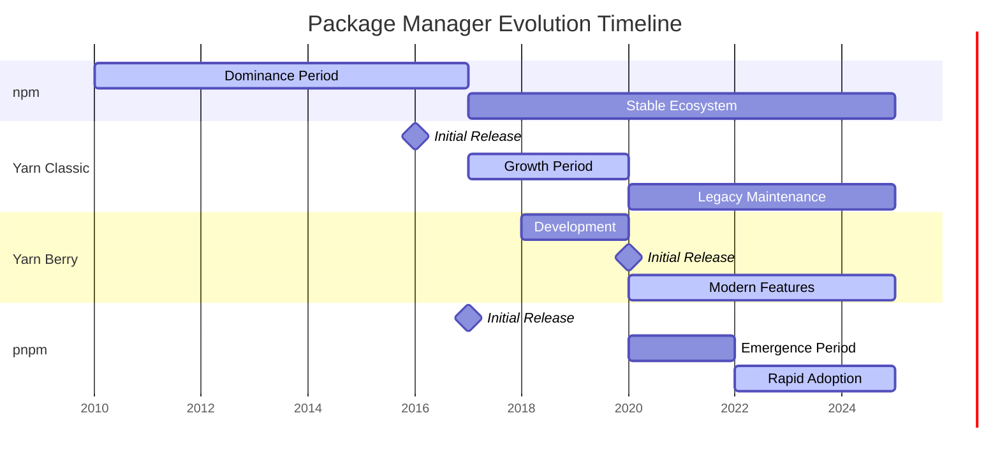
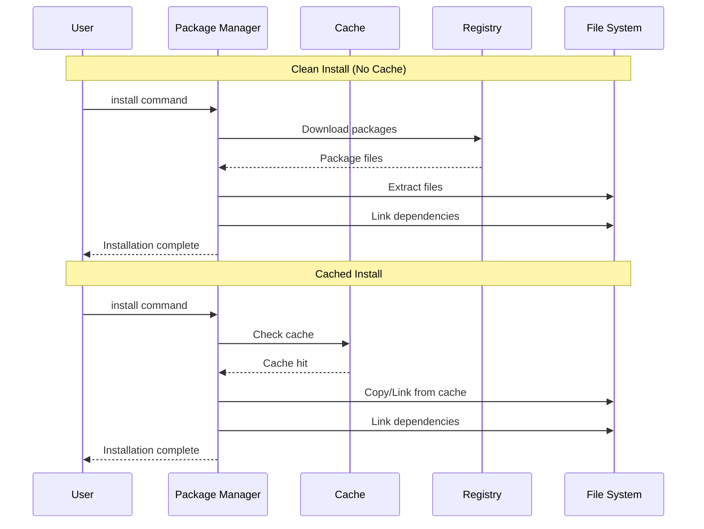
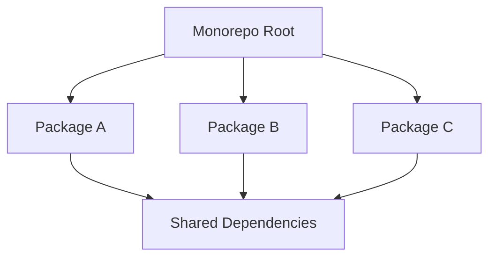
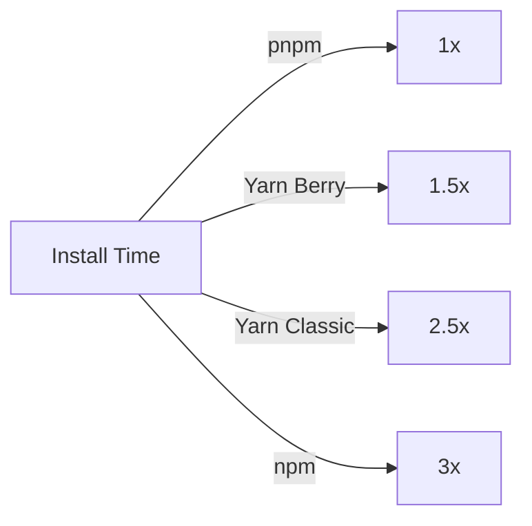
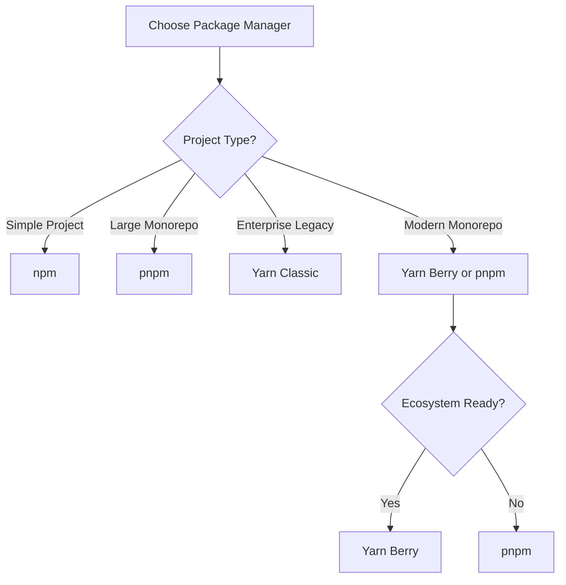

# NPM Package Managers Comparison: npm vs Yarn vs pnpm

## Introduction

The JavaScript ecosystem has evolved significantly over the years, and with it, the tools for managing dependencies. This article provides a comprehensive comparison of the four major package managers: **npm**, **Yarn Classic (1.x)**, **Yarn Berry (2.x+)**, and **pnpm**, with a special focus on monorepo management capabilities.

### Quick Overview

| Package Manager    | Initial Release | Maintained By      | Key Philosophy               |
|--------------------|-----------------|--------------------|------------------------------|
| npm                | 2010            | npm, Inc. (Microsoft) | Default, batteries-included  |
| Yarn Classic (1.x) | 2016            | Meta (Facebook)    | Fast, reliable, secure       |
| Yarn Berry (2.x+)  | 2020            | Yarn Team          | Plug'n'Play, zero-installs   |
| pnpm               | 2017            | Zoltan Kochan      | Efficient disk usage, strict |

## Popularity and Adoption

### Market Share and Trends



| Metric              | npm                  | Yarn Classic | Yarn Berry  | pnpm         |
|---------------------|----------------------|--------------|-------------|--------------|
| GitHub Stars        | 25k+                 | 41k+         | (same repo) | 28k+         |
| Weekly Downloads    | Default with Node.js | ~3M          | ~500k       | ~2M          |
| Corporate Adoption  | Universal            | High         | Growing     | Rapid growth |
| Community Sentiment | Stable               | Legacy       | Polarizing  | Enthusiastic |

### Usage Statistics (2024)
According to the State of Frontend Report 2024[^1]:
- **npm**: 56.6% market share (default choice)
- **Yarn Classic**: 21.5% (legacy but stable)
- **pnpm**: 19.9% (rapidly growing, predicted to reach 25-30% by end of 2025[^2])
- **Yarn Berry**: ~3% (niche adoption)

## Installation Speed and Performance

### Benchmark Comparison



| Scenario                     | npm   | Yarn Classic | Yarn Berry | pnpm       |
|------------------------------|-------|--------------|------------|------------|
| Clean install (no cache)[^3] | 35.3s | 7.0s         | 3.5s       | 9.1s       |
| Cached install[^3]           | 1.3s  | 4.9s         | 1.3s       | 0.73s      |
| Monorepo install             | 120%  | 90%          | 50%        | 40%        |
| Disk space usage             | 100%  | 100%         | 80%        | 20-30%[^4] |

*Performance data from pnpm.io benchmarks (2025)[^3]*

### Performance Characteristics

**npm**
- Moderate speed
- Improved significantly in v7+
- Parallel downloads since v5

**Yarn Classic**
- Parallel package downloads
- Deterministic installs
- Offline mode support

**Yarn Berry**
- Plug'n'Play eliminates node_modules
- Near-instant installs with zero-installs
- Requires ecosystem compatibility

**pnpm**
- Content-addressable storage
- Hard links save disk space (up to 80% reduction)[^4]
- Fastest for monorepos
- Fastest cached installs (0.73s)[^3]

## Cache Management

### Cache Location and Structure

| Package Manager | Cache Location          | Structure                      |
|-----------------|-------------------------|--------------------------------|
| npm             | `~/.npm`                | Compressed tarballs by package |
| Yarn Classic    | `~/.cache/yarn`         | Compressed tarballs + metadata |
| Yarn Berry      | `.yarn/cache` (project) | ZIP files, can be committed    |
| pnpm            | `~/.pnpm-store`         | Content-addressable storage    |

### Cache Commands

```shell
# npm
# Forcefully clears the entire npm cache
npm cache clean --force
# Verifies cache integrity and cleans up corrupted entries
npm cache verify
# Lists cached packages (deprecated in newer versions, use npm cache verify instead)
npm cache ls

# Yarn Classic
# Removes all cached packages
yarn cache clean
# Shows all cached packages
yarn cache list
# Displays the cache directory path
yarn cache dir

# Yarn Berry
# Removes all cached packages (--all flag clears everything)
# Cache is project-local in .yarn/cache directory
yarn cache clean --all

# pnpm
# Removes unreferenced packages from the store
pnpm store prune
# Shows information about the store (size, integrity)
pnpm store status
# Displays the path to the pnpm store
pnpm store path
```

### Cache Policies

**npm**
- Automatic cache management
- Corruption detection
- TTL-based invalidation

**Yarn Classic**
- Persistent cache
- Offline mirror support
- Manual cleanup required

**Yarn Berry**
- Zero-installs philosophy
- Commit cache to git (optional)
- Predictable CI builds

**pnpm**
- Global store deduplication
- Automatic garbage collection
- Hard link optimization

## Dependency Structure and Linking

### Directory Structures

**npm/Yarn Classic - Nested Structure:**
```text
project/
├── node_modules/
│   ├── react/
│   │   ├── package.json
│   │   └── node_modules/
│   │       └── loose-envify/
│   ├── react-dom/
│   │   └── node_modules/
│   │       └── loose-envify/
│   └── express/
```

**pnpm - Flat with Symlinks:**
```text
project/
├── node_modules/
│   ├── .pnpm/
│   │   ├── react@18.2.0/
│   │   │   └── node_modules/
│   │   │       └── react/
│   │   └── express@4.18.2/
│   ├── react -> .pnpm/react@18.2.0/node_modules/react
│   └── express -> .pnpm/express@4.18.2/node_modules/express
```

**Yarn Berry - Plug'n'Play:**
```text
project/
├── .yarn/
│   ├── cache/
│   │   ├── react-npm-18.2.0-abc123.zip
│   │   └── express-npm-4.18.2-def456.zip
│   └── pnp.cjs
├── .pnp.loader.mjs
└── package.json
```

### Local Package Development

```bash
# npm
npm link ../my-package
npm link my-package

# Yarn Classic
yarn link
cd ../project && yarn link my-package

# Yarn Berry
yarn link ../my-package

# pnpm
pnpm link ../my-package
# or use workspace protocol
```

### Linking Comparison

| Feature            | npm | Yarn Classic | Yarn Berry | pnpm |
|--------------------|-----|--------------|------------|------|
| Global links       | ✅   | ✅            | ❌          | ✅    |
| Relative links     | ✅   | ✅            | ✅          | ✅    |
| Portal protocol    | ❌   | ❌            | ✅          | ❌    |
| Workspace protocol | ✅   | ✅            | ✅          | ✅    |

## Monorepo Management

### Native Workspace Support



### Workspace Configuration

**npm/Yarn Classic - package.json:**
```json
{
  "workspaces": [
    "packages/*",
    "apps/*"
  ]
}
```

**Yarn Berry - package.json:**
```json
{
  "workspaces": [
    "packages/*",
    "apps/*"
  ]
}
```

**pnpm - pnpm-workspace.yaml:**
```yaml
packages:
  - 'packages/*'
  - 'apps/*'
  - '!**/test/**'
```

### Workspace Features Comparison

| Feature              | npm    | Yarn Classic | Yarn Berry  | pnpm      |
|----------------------|--------|--------------|-------------|-----------|
| Workspace protocol   | ✅      | ✅            | ✅           | ✅         |
| Selective execution  | ✅      | ✅            | ✅           | ✅         |
| Parallel execution   | ❌      | ✅            | ✅           | ✅         |
| Dependency filtering | Basic  | Good         | Excellent   | Excellent |
| Cross-package bins   | ✅      | ✅            | ✅           | ✅         |
| Constraints/Rules    | ❌      | ❌            | ✅           | ❌         |
| Version syncing      | Manual | Manual       | Constraints | Catalogs  |

### Monorepo Commands

```bash
# npm (v7+)
npm install --workspace=package-a
npm run build --workspaces
npm run test --workspace=package-a

# Yarn Classic
yarn workspace package-a add lodash
yarn workspaces run build
yarn workspaces info

# Yarn Berry
yarn workspace package-a add lodash
yarn workspaces foreach run build
yarn constraints check

# pnpm
pnpm add lodash --filter package-a
pnpm run --recursive build
pnpm run --filter "./packages/**" test
```

### Advanced Monorepo Features

**npm**
- Basic workspace support
- Limited filtering options
- No parallel execution

**Yarn Classic**
- Mature workspace implementation
- Good inter-package resolution
- Limited tooling

**Yarn Berry**
- Constraints engine for validation
- Protocol support (workspace:, portal:, exec:)
- Advanced plugin system
- Interactive upgrade workflow

**pnpm**
- Powerful filtering syntax
- Catalog protocol for version management
- Excellent performance at scale
- Built-in changeset support

### Monorepo Performance



## CI/CD Integration

### GitHub Actions

**npm:**
```yaml
- uses: actions/setup-node@v3
  with:
    node-version: '18'
    cache: 'npm'
- run: npm ci
```

**Yarn Classic:**
```yaml
- uses: actions/setup-node@v3
  with:
    node-version: '18'
    cache: 'yarn'
- run: yarn install --frozen-lockfile
```

**Yarn Berry:**
```yaml
- uses: actions/setup-node@v3
  with:
    node-version: '18'
- run: corepack enable
- run: yarn install --immutable
```

**pnpm:**
```yaml
- uses: pnpm/action-setup@v2
  with:
    version: 8
- uses: actions/setup-node@v3
  with:
    node-version: '18'
    cache: 'pnpm'
- run: pnpm install --frozen-lockfile
```

### GitLab CI

```yaml
# npm
install:
  script:
    - npm ci
  cache:
    paths:
      - .npm/

# Yarn Classic
install:
  script:
    - yarn install --frozen-lockfile
  cache:
    paths:
      - .yarn-cache/

# Yarn Berry
install:
  script:
    - corepack enable
    - yarn install --immutable
  cache:
    paths:
      - .yarn/cache/

# pnpm
install:
  script:
    - corepack enable
    - pnpm install --frozen-lockfile
  cache:
    paths:
      - .pnpm-store/
```

### CI Performance Comparison

| Aspect              | npm  | Yarn Classic | Yarn Berry | pnpm      |
|---------------------|------|--------------|------------|-----------|
| Cache restoration   | Slow | Medium       | Fast*      | Fast      |
| Install speed       | Slow | Medium       | Instant*   | Fast      |
| Lockfile validation | Good | Good         | Excellent  | Excellent |
| Reproducibility     | Good | Good         | Excellent  | Excellent |

*With zero-installs enabled

## Dependency Management Commands

### Command Comparison Table

| Action             | npm                  | Yarn Classic                     | Yarn Berry                 | pnpm                             |
|--------------------|----------------------|----------------------------------|----------------------------|----------------------------------|
| Install all        | `npm install`        | `yarn install`                   | `yarn install`             | `pnpm install`                   |
| Add package        | `npm install pkg`    | `yarn add pkg`                   | `yarn add pkg`             | `pnpm add pkg`                   |
| Add dev dep        | `npm install -D pkg` | `yarn add -D pkg`                | `yarn add -D pkg`          | `pnpm add -D pkg`                |
| Remove package     | `npm uninstall pkg`  | `yarn remove pkg`                | `yarn remove pkg`          | `pnpm remove pkg`                |
| Update package     | `npm update pkg`     | `yarn upgrade pkg`               | `yarn up pkg`              | `pnpm update pkg`                |
| Update all         | `npm update`         | `yarn upgrade`                   | `yarn up`                  | `pnpm update`                    |
| Interactive update | -                    | `yarn upgrade-interactive`       | `yarn upgrade-interactive` | `pnpm update -i`                 |
| Audit              | `npm audit`          | `yarn audit`                     | `yarn npm audit`           | `pnpm audit`                     |
| Clean install      | `npm ci`             | `yarn install --frozen-lockfile` | `yarn install --immutable` | `pnpm install --frozen-lockfile` |

### Upgrading All Dependencies

**npm:**
```bash
# Update to latest allowed by package.json
npm update

# Update to latest versions (requires npm-check-updates)
npx npm-check-updates -u
npm install
```

**Yarn Classic:**
```bash
# Interactive
yarn upgrade-interactive --latest

# All to latest
yarn upgrade --latest
```

**Yarn Berry:**
```bash
# Interactive with groups
yarn upgrade-interactive

# Plugin for more power
yarn plugin import interactive-tools
yarn upgrade-interactive
```

**pnpm:**
```bash
# Interactive
pnpm update --interactive --latest

# All to latest
pnpm update --latest -r
```

### Version Bumping

```bash
# npm
npm version patch/minor/major

# Yarn (all versions)
yarn version --patch/--minor/--major

# pnpm
pnpm version patch/minor/major

# Monorepo version bumping
# npm - manual or use tools like lerna
# Yarn Berry - yarn version check --interactive
# pnpm - use changesets
pnpm changeset
pnpm version-packages
```

## Unique Features and Considerations

### Dependency Shadowing Problems

**Problem Example:**
```
app/
├── node_modules/
│   ├── lodash@4.17.21
│   └── old-lib/
│       └── node_modules/
│           └── lodash@3.10.1  # Shadow dependency
```

**Solutions by Package Manager:**

| Package Manager | Shadow Handling        | Solution                |
|-----------------|------------------------|-------------------------|
| npm             | Flattens when possible | Automatic deduplication |
| Yarn Classic    | Flattens aggressively  | Resolutions field       |
| Yarn Berry      | No node_modules        | Not applicable          |
| pnpm            | Strict isolation       | No shadowing possible   |

**Resolution Configuration:**

```json
// Yarn Classic/Berry - package.json
{
  "resolutions": {
    "lodash": "4.17.21",
    "**/lodash": "4.17.21"
  }
}

// npm - package.json
{
  "overrides": {
    "lodash": "4.17.21"
  }
}

// pnpm - package.json
{
  "pnpm": {
    "overrides": {
      "lodash": "4.17.21"
    }
  }
}
```

### Outstanding Features by Package Manager

**npm:**
- Default with Node.js
- Largest ecosystem
- Workspaces support (v7+)
- Fund command for OSS support

**Yarn Classic:**
- Yarn.lock for determinism
- Offline mirror
- License checker
- Selective version resolutions

**Yarn Berry:**
- Plug'n'Play (no node_modules)
- Zero-installs
- Constraints engine
- Protocols (workspace:, portal:, patch:, exec:)
- Built-in patch support
- Plugin architecture

**pnpm:**
- Content-addressable storage
- Strictest dependency isolation
- Fastest for monorepos
- Catalog protocol
- Built-in patching
- Side-effects cache

### Strict Installation Comparison

| Strictness Level      | npm       | Yarn Classic | Yarn Berry  | pnpm         |
|-----------------------|-----------|--------------|-------------|--------------|
| Phantom dependencies  | Allowed   | Allowed      | Prevented   | Prevented    |
| Implicit dependencies | Allowed   | Allowed      | Error       | Error        |
| Version conflicts     | Last wins | Resolutions  | Resolutions | Strict       |
| Peer dependencies     | Warning   | Warning      | Error*      | Auto-install |

*Configurable

## Summary and Recommendations

### Decision Matrix



### Recommendations by Use Case

| Use Case                      | Recommended        | Why                          |
|-------------------------------|--------------------|------------------------------|
| Small projects                | npm                | Simplicity, no setup         |
| Large monorepos               | pnpm               | Performance, disk efficiency |
| Enterprise with legacy        | Yarn Classic       | Stability, compatibility     |
| Cutting-edge monorepos        | Yarn Berry         | Advanced features            |
| Open source libraries         | npm                | Widest compatibility         |
| Disk-constrained environments | pnpm               | Space efficiency             |
| CI/CD optimization            | Yarn Berry or pnpm | Speed, caching               |

### Migration Paths

```bash
# npm → pnpm
npx pnpm import
pnpm install

# Yarn Classic → Yarn Berry
yarn set version berry
yarn install

# Any → pnpm (monorepo)
pnpm import
# Create pnpm-workspace.yaml
pnpm install
```

### Final Verdict

- **npm**: Best for beginners and simple projects
- **Yarn Classic**: Good for stability-focused teams
- **Yarn Berry**: Excellent for advanced users willing to adapt
- **pnpm**: Best overall for monorepos and performance

### Key Takeaways

1. **For monorepos**: pnpm offers the best balance of features and performance
2. **For compatibility**: npm remains the safest choice
3. **For innovation**: Yarn Berry pushes boundaries but requires commitment
4. **For migration**: pnpm provides the smoothest path from other managers

The JavaScript package management landscape continues to evolve, with each tool carving out its niche. Choose based on your project's specific needs, team expertise, and performance requirements.

## References

[^1]: https://dev.to/hamzakhan/npm-vs-yarn-vs-pnpm-which-package-manager-should-you-use-in-2025-2f1g - State of Frontend Report 2024 market share data

[^2]: https://programmingly.dev/npm-vs-yarn-vs-pnpm-choosing-the-right-package-manager-for-your-project/ - pnpm growth predictions and developer preference analysis

[^3]: https://pnpm.io/benchmarks - Performance benchmarks data (2025)

[^4]: https://dev.to/wojtekmaj/package-manager-wars-the-real-picture-e9p - Disk space efficiency analysis
