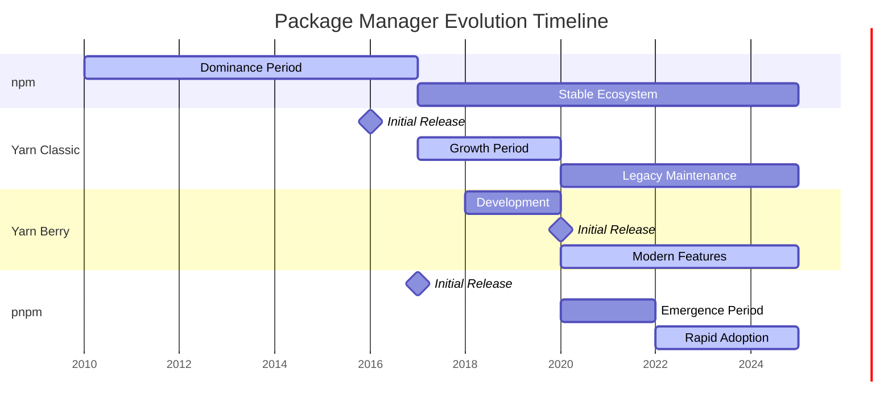
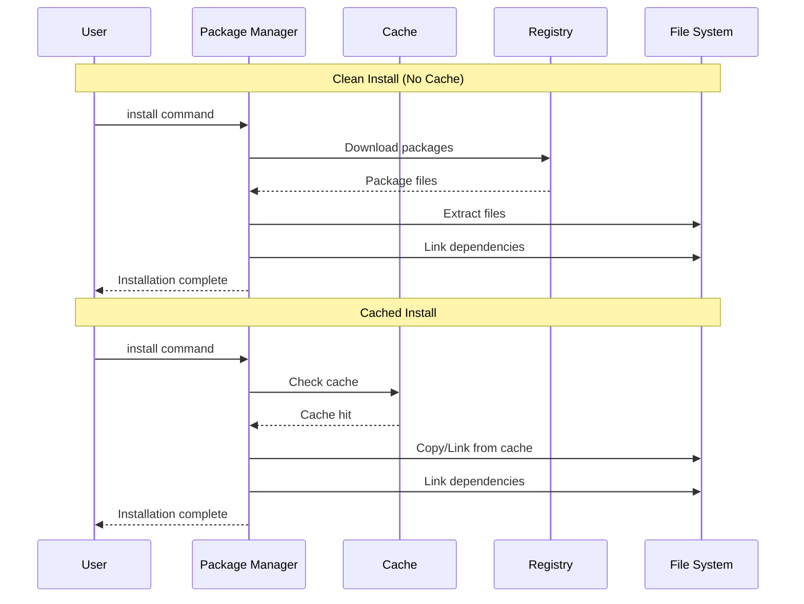
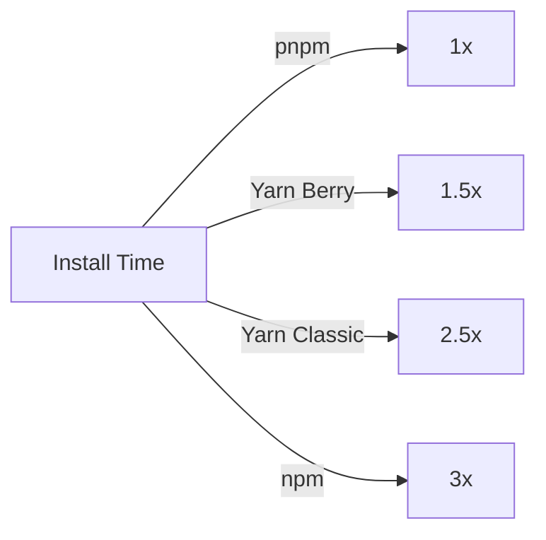

# NPM Package Managers Comparison: npm vs Yarn vs pnpm

## Introduction

The JavaScript ecosystem has evolved significantly over the years, and with it, the tools for managing dependencies.
This article provides a comprehensive comparison of the four major package managers: **npm**, **Yarn Classic (1.x)**, **Yarn Berry (2.x+)**, and **pnpm**, with a special focus on monorepo management capabilities.

### TL;DR - Which Package Manager Should I Use?

- **npm**: Default choice for simple projects, comes with Node.js
- **pnpm**: Best for monorepos and when disk space matters (up to 80% savings)
- **Yarn Classic**: Legacy projects only - consider migrating to pnpm or Yarn Berry
- **Yarn Berry**: Cutting-edge features with PnP, but requires ecosystem compatibility

**Quick Decision Guide:**

- Small project, getting started → **npm**
- Large monorepo or multiple projects → **pnpm**
- Need specific Yarn features → **Yarn Berry**
- Maintaining existing project → **Keep current, plan migration**

### Quick Overview

| Package Manager    | Initial Release | Maintained By         | Key Philosophy               |
|--------------------|-----------------|-----------------------|------------------------------|
| npm                | 2010            | npm, Inc. (Microsoft) | Default, batteries-included  |
| Yarn Classic (1.x) | 2016            | Meta (Facebook)       | Fast, reliable, secure       |
| Yarn Berry (2.x+)  | 2020            | Yarn Team             | Plug'n'Play, zero-installs   |
| pnpm               | 2017            | Zoltan Kochan         | Efficient disk usage, strict |

## Popularity and Adoption

### Market Share and Trends



| Metric              | npm                  | Yarn Classic | Yarn Berry  | pnpm         |
|---------------------|----------------------|--------------|-------------|--------------|
| GitHub Stars        | 25k+                 | 41k+         | (same repo) | 28k+         |
| Weekly Downloads    | Default with Node.js | ~3M          | ~500k       | ~2M          |
| Corporate Adoption  | Universal            | High         | Growing     | Rapid growth |
| Community Sentiment | Stable               | Legacy       | Polarizing  | Enthusiastic |

### Usage Statistics (2024)

According to independent reviews and survey results:

- **npm**: 56.6% market share (default choice)[1][2]
- **Yarn Classic**: 21.5% (legacy but stable)[1][2]
- **pnpm**: 19.9% (rapidly growing—predicted to reach 25-30% by end of 2025 but predictions are speculative)[1][2][5]
- **Yarn Berry**: Remains a niche tool with low market share; specific numbers are rarely published, but industry discussion places it below npm, Yarn Classic, and pnpm[1][2]

> The Software House's 2024 State of Frontend Report (over 6,000 developers):  
> "npm is the most widely used package manager (56.6% of votes), followed by Yarn Classic (21.5%) and pnpm (19.9%)"[1][2].

## Installation Speed and Performance

### Benchmark Comparison



#### Benchmark Comparison

| Scenario                 | npm    | Yarn Classic | Yarn Berry | pnpm                 |
|--------------------------|--------|--------------|------------|----------------------|
| Clean install (no cache) | ~28.6s | ~8.5s        | ~7.0s      | 3–9s                 |
| Cached install           | ~1.3s  | ~4.9s        | ~1.3s      | ~0.73s               |
| Monorepo install*        | High   | Moderate     | Lower      | Lowest               |
| Disk space usage         | 100%   | 100%         | ~80%       | 20-30%[6][7][11][17] |

*Monorepo install values are relative: pnpm is consistently the fastest and most space-efficient, especially as the number of projects grows[6][7][11][17].

#### Performance Characteristics

- **npm**: Moderate speed, improved in v7+, now supports parallel downloads since v5[11].
- **Yarn Classic**: Parallel package downloads, deterministic installs, stable but not actively developed[11].
- **Yarn Berry**: Plug'n'Play technology, zero-installs, fastest in some scenarios, ecosystem compatibility needs attention[11].
- **pnpm**: Content-addressable storage and global hard links drastically reduce disk space in multi-project setups (up to 70–80% savings); fastest for monorepos and cached installs[6][7][12][17].

### Performance Characteristics

**npm**

- Moderate speed
- Improved significantly in v7+
- Parallel downloads since v5

**Yarn Classic**

- Parallel package downloads
- Deterministic installs
- Offline mode support

**Yarn Berry**

- Plug'n'Play eliminates node_modules
- Near-instant installs with zero-installs
- Requires ecosystem compatibility

**pnpm**

- Content-addressable storage
- Hard links save disk space (up to 80% reduction)[^4]
- Fastest for monorepos
- Fastest cached installs (0.73s)[^3]

### Cache Management

#### Cache Location and Structure

| Package Manager | Cache Location          | Structure                              |
|-----------------|-------------------------|----------------------------------------|
| npm             | `~/.npm`                | Compressed tarballs by package[9][14]  |
| Yarn Classic    | `~/.cache/yarn`         | Compressed tarballs + metadata[13]     |
| Yarn Berry      | `.yarn/cache` (project) | ZIP files, can be committed[8]         |
| pnpm            | `~/.pnpm-store`         | Content-addressable storage[7][12][17] |

- **npm**: Default cache is `~/.npm` (or `%AppData%\npm-cache` on Windows), stores package tarballs and metadata[9][14].
- **Yarn Classic**: Caches tarballs and metadata, default `~/.cache/yarn`, but can be customized[13].
- **Yarn Berry**: Uses `.yarn/cache` directory in each project, storing ZIP archives of dependencies, often committed for offline/CI installs[8].
- **pnpm**: Global cache at `~/.pnpm-store`, uses hard links or symlinks from global store to each project's `node_modules` (saves ~70% disk space when used across multiple projects)[6][7][12][17].

### Cache Commands

```shell
# npm
# Forcefully clears the entire npm cache
npm cache clean --force
# Verifies cache integrity and cleans up corrupted entries
npm cache verify
# Lists cached packages (deprecated in newer versions, use npm cache verify instead)
npm cache ls

# Yarn Classic
# Removes all cached packages
yarn cache clean
# Shows all cached packages
yarn cache list
# Displays the cache directory path
yarn cache dir

# Yarn Berry
# Removes all cached packages (--all flag clears everything)
# Cache is project-local in .yarn/cache directory
yarn cache clean --all

# pnpm
# Removes unreferenced packages from the store
pnpm store prune
# Shows information about the store (size, integrity)
pnpm store status
# Displays the path to the pnpm store
pnpm store path
```

### Cache Policies

**npm**

- Automatic cache management
- Corruption detection (`npm cache verify`)
- TTL-based invalidation

**Yarn Classic**

- Persistent cache
- Offline mirror support
- Manual cleanup required
- Integrity check with `yarn check --integrity`

**Yarn Berry**

- Zero-installs philosophy
- Commit cache to git (optional)
- Predictable CI builds

**pnpm**

- Global store deduplication
- Automatic garbage collection (`pnpm store prune`)
- Hard link optimization
- Store verification with `pnpm store status`

## Dependency Structure and Linking

### Directory Structures

**npm/Yarn Classic - Nested Structure:**

```text
project/
├── node_modules/
│   ├── react/
│   │   ├── package.json
│   │   └── node_modules/
│   │       └── loose-envify/
│   ├── react-dom/
│   │   └── node_modules/
│   │       └── loose-envify/
│   └── express/
```

**pnpm - Flat with Symlinks:**

```text
project/
├── node_modules/
│   ├── .pnpm/
│   │   ├── react@18.2.0/
│   │   │   └── node_modules/
│   │   │       └── react/
│   │   └── express@4.18.2/
│   ├── react -> .pnpm/react@18.2.0/node_modules/react
│   └── express -> .pnpm/express@4.18.2/node_modules/express
```

**Yarn Berry - Plug'n'Play:**

```text
project/
├── .yarn/
│   ├── cache/
│   │   ├── react-npm-18.2.0-abc123.zip
│   │   └── express-npm-4.18.2-def456.zip
│   └── pnp.cjs
├── .pnp.loader.mjs
└── package.json
```

### Local Package Development

```bash
# npm
npm link ../my-package
npm link my-package

# Yarn Classic
yarn link
cd ../project && yarn link my-package

# Yarn Berry
yarn link ../my-package

# pnpm
pnpm link ../my-package
# or use workspace protocol
```

### Linking Comparison

| Feature            | npm | Yarn Classic | Yarn Berry | pnpm |
|--------------------|-----|--------------|------------|------|
| Global links       | ✅   | ✅            | ❌          | ✅    |
| Relative links     | ✅   | ✅            | ✅          | ✅    |
| Portal protocol    | ❌   | ❌            | ✅          | ❌    |
| Workspace protocol | ✅   | ✅            | ✅          | ✅    |

## Monorepo Management

### Workspace Configuration

**npm/Yarn Classic - package.json:**

```json
{
  "workspaces": [
    "packages/*",
    "apps/*"
  ]
}
```

**Yarn Berry - package.json:**

```json
{
  "workspaces": [
    "packages/*",
    "apps/*"
  ]
}
```

**pnpm - pnpm-workspace.yaml:**

```yaml
packages:
  - 'packages/*'
  - 'apps/*'
  - '!**/test/**'
```

### Workspace Features Comparison

| Feature              | npm    | Yarn Classic | Yarn Berry  | pnpm      |
|----------------------|--------|--------------|-------------|-----------|
| Workspace protocol   | ✅      | ✅            | ✅           | ✅         |
| Selective execution  | ✅      | ✅            | ✅           | ✅         |
| Parallel execution   | ❌      | ✅            | ✅           | ✅         |
| Dependency filtering | Basic  | Good         | Excellent   | Excellent |
| Cross-package bins   | ✅      | ✅            | ✅           | ✅         |
| Constraints/Rules    | ❌      | ❌            | ✅           | ❌         |
| Version syncing      | Manual | Manual       | Constraints | Catalogs  |

### Monorepo Commands

```bash
# npm (v7+)
npm install --workspace=package-a
npm run build --workspaces
npm run test --workspace=package-a

# Yarn Classic
yarn workspace package-a add lodash
yarn workspaces run build
yarn workspaces info

# Yarn Berry
yarn workspace package-a add lodash
yarn workspaces foreach run build
yarn constraints check

# pnpm
pnpm add lodash --filter package-a
pnpm run --recursive build
pnpm run --filter "./packages/**" test
```

### Advanced Monorepo Features

**npm**

- Basic workspace support
- Limited filtering options
- Use `npm ls` to visualize workspace dependencies

**Yarn Classic**

- Mature workspace implementation
- Good inter-package resolution
- Limited tooling

**Yarn Berry**

- Constraints engine for validation (enforces dependency rules)
- Protocol support (workspace:, portal:, exec:, patch:)
- Advanced plugin system
- Interactive upgrade workflow
- `yarn explain` for peer dependency debugging

**pnpm**

- Powerful filtering syntax
- Catalog protocol for version management
- Excellent performance at scale
- Built-in changeset support
- `pnpm why -r` for workspace-wide dependency analysis

### Monorepo Performance



## CI/CD Integration

### GitHub Actions

**npm:**

```yaml
- uses: actions/setup-node@v4
  with:
    node-version: '22'
    cache: 'npm'
- run: npm ci
```

**Yarn Classic:**

```yaml
- uses: actions/setup-node@v4
  with:
    node-version: '22'
    cache: 'yarn'
- run: yarn install --frozen-lockfile
```

**Yarn Berry:**

```yaml
- uses: actions/setup-node@v4
  with:
    node-version: '22'
- run: corepack enable
- run: yarn install --immutable
```

**pnpm:**

```yaml
- uses: pnpm/action-setup@v4
  with:
    version: 10
- uses: actions/setup-node@v4
  with:
    node-version: '22'
    cache: 'pnpm'
- run: pnpm install --frozen-lockfile
```

### GitLab CI

**npm:**

```yaml
install-npm:
  image: node:22-alpine
  script:
    - npm ci
  cache:
    key: npm-$CI_COMMIT_REF_SLUG
    paths:
      - .npm/
```

**Yarn Classic:**

```yaml
install-yarn-classic:
  image: node:22-alpine
  script:
    - yarn install --frozen-lockfile
  cache:
    key: yarn-$CI_COMMIT_REF_SLUG
    paths:
      - .yarn-cache/
```

**Yarn Berry:**

```yaml
install-yarn-berry:
  image: node:22-alpine
  script:
    - corepack enable
    - yarn install --immutable
  cache:
    key: yarn-berry-$CI_COMMIT_REF_SLUG
    paths:
      - .yarn/cache/
```

**pnpm:**

```yaml
install-pnpm:
  image: node:22-alpine
  script:
    - corepack enable
    - pnpm install --frozen-lockfile
  cache:
    key: pnpm-$CI_COMMIT_REF_SLUG
    paths:
      - .pnpm-store/
```

### Docker Integration

**Multi-stage Dockerfile example:**

```dockerfile
# Use Node.js 22
FROM node:22-alpine AS base

# Install dependencies only when needed
FROM base AS deps
WORKDIR /app

# Copy package files
COPY package*.json ./
# Choose your package manager
RUN npm ci --only=production

# Development image
FROM base AS dev
WORKDIR /app
COPY package*.json ./
RUN npm ci
COPY . .
CMD ["npm", "run", "dev"]

# Production image
FROM base AS production
WORKDIR /app
COPY --from=deps /app/node_modules ./node_modules
COPY . .
RUN npm run build
CMD ["npm", "start"]
```

## Dependency Management Commands

### Command Comparison Table

| Action             | npm                  | Yarn Classic                     | Yarn Berry                 | pnpm                             |
|--------------------|----------------------|----------------------------------|----------------------------|----------------------------------|
| Install all        | `npm install`        | `yarn install`                   | `yarn install`             | `pnpm install`                   |
| Add package        | `npm install pkg`    | `yarn add pkg`                   | `yarn add pkg`             | `pnpm add pkg`                   |
| Add dev dep        | `npm install -D pkg` | `yarn add -D pkg`                | `yarn add -D pkg`          | `pnpm add -D pkg`                |
| Remove package     | `npm uninstall pkg`  | `yarn remove pkg`                | `yarn remove pkg`          | `pnpm remove pkg`                |
| Update package     | `npm update pkg`     | `yarn upgrade pkg`               | `yarn up pkg`              | `pnpm update pkg`                |
| Update all         | `npm update`         | `yarn upgrade`                   | `yarn up`                  | `pnpm update`                    |
| Interactive update | -                    | `yarn upgrade-interactive`       | `yarn upgrade-interactive` | `pnpm update -i`                 |
| Audit              | `npm audit`          | `yarn audit`                     | `yarn npm audit`           | `pnpm audit`                     |
| Clean install      | `npm ci`             | `yarn install --frozen-lockfile` | `yarn install --immutable` | `pnpm install --frozen-lockfile` |

### Upgrading All Dependencies

**npm:**

```bash
# Update to latest allowed by package.json
npm update

# Update to latest versions (requires npm-check-updates)
npx npm-check-updates -u
npm install
```

**Yarn Classic:**

```bash
# Interactive
yarn upgrade-interactive --latest

# All to latest
yarn upgrade --latest
```

**Yarn Berry:**

```bash
# Interactive with groups
yarn upgrade-interactive

# Plugin for more power
yarn plugin import interactive-tools
yarn upgrade-interactive
```

**pnpm:**

```bash
# Interactive
pnpm update --interactive --latest

# All to latest
pnpm update --latest -r
```

### Version Bumping

```bash
# npm
npm version patch/minor/major

# Yarn (all versions)
yarn version --patch/--minor/--major

# pnpm
pnpm version patch/minor/major

# Monorepo version bumping
# npm - manual or use tools like lerna
# Yarn Berry - yarn version check --interactive
# pnpm - use changesets
pnpm changeset
pnpm version-packages
```

## Built-in Dependency Problem Solving Tools

### Key Commands Comparison

| Command Type         | npm             | Yarn Classic    | Yarn Berry       | pnpm                |
|----------------------|-----------------|-----------------|------------------|---------------------|
| **Security audit**   | `npm audit`     | `yarn audit`    | `yarn npm audit` | `pnpm audit`        |
| **Auto-fix**         | `npm audit fix` | ❌               | ❌                | `pnpm audit --fix`  |
| **Why installed**    | `npm explain`   | `yarn why`      | `yarn why`       | `pnpm why`          |
| **Deduplicate**      | `npm dedupe`    | ❌               | `yarn dedupe`    | Automatic           |
| **List deps**        | `npm ls`        | `yarn list`     | `yarn info`      | `pnpm list`         |
| **Check outdated**   | `npm outdated`  | `yarn outdated` | `yarn up -i`     | `pnpm outdated`     |
| **Verify integrity** | `npm doctor`    | `yarn check`    | Built-in         | `pnpm store status` |

### Dependency Resolution & Overrides

| Package Manager | Field Name       | Example Syntax           | Advanced Features      |
|-----------------|------------------|--------------------------|------------------------|
| npm             | `overrides`      | `"lodash": "4.17.21"`    | Basic version override |
| Yarn            | `resolutions`    | `"**/lodash": "4.17.21"` | Glob patterns          |
| pnpm            | `pnpm.overrides` | `"foo>bar": "2.0.0"`     | Nested dependencies    |

### Unique Features

**npm:**

- `npm doctor` - Diagnoses npm installation issues
- `npm ci` - Clean install for CI environments

**Yarn Classic:**

- Global resolutions field
- `yarn check --integrity` - Verify lockfile

**Yarn Berry:**

- Constraints engine (`.yarn/constraints.pro`)
- Resolution protocols (portal:, patch:, exec:)
- PnP prevents phantom dependencies

**pnpm:**

- Strictest by default (no phantom deps)
- Content-addressable store (`pnpm store`)
- Peer dependency auto-installation

### Common Problems Quick Reference

**Version Conflicts:**

```bash
npm ls package-name      # npm
yarn why package-name    # Yarn
pnpm why package-name    # pnpm
```

**Security Issues:**

```bash
npm audit fix            # npm
yarn upgrade pkg@ver     # Yarn (manual)
pnpm audit --fix        # pnpm
```

**Phantom Dependencies:**

- npm/Yarn Classic: No protection
- Yarn Berry: Use PnP mode
- pnpm: Protected by default

## Unique Features and Considerations

### Dependency Shadowing & Resolution

**Shadowing Problem:** When different versions of the same package exist in nested node_modules:

```text
app/node_modules/
├── lodash@4.17.21
└── old-lib/node_modules/
    └── lodash@3.10.1  # Shadow dependency
```

| Package Manager | Shadow Prevention | Resolution Method                        |
|-----------------|-------------------|------------------------------------------|
| npm             | Partial           | Flattens when possible, use `overrides`  |
| Yarn Classic    | Partial           | Aggressive flattening, use `resolutions` |
| Yarn Berry      | Complete          | No node_modules (PnP mode)               |
| pnpm            | Complete          | Strict isolation by default              |

**Resolution Examples:**

Force all lodash to specific version:

```json
"overrides": {"lodash": "4.17.21"}
```

```json
"resolutions": {"**/lodash": "4.17.21"}
```

```json
"pnpm": {"overrides": {"lodash": "4.17.21"}}
```

Target specific dependency paths:

```json
"overrides": {"package-a": {"lodash": "3.10.1"}}
```

```json
"resolutions": {"package-a/lodash": "3.10.1"}
```

```json
"pnpm": {"overrides": {"package-a>lodash": "3.10.1"}}
```

### Outstanding Features by Package Manager

**npm:**

- Default with Node.js
- Largest ecosystem
- Workspaces support (v7+)
- Fund command for OSS support

**Yarn Classic:**

- Yarn.lock for determinism
- Offline mirror
- License checker
- Selective version resolutions

**Yarn Berry:**

- Plug'n'Play (no node_modules)
- Zero-installs
- Constraints engine
- Protocols (workspace:, portal:, patch:, exec:)
- Built-in patch support
- Plugin architecture

**pnpm:**

- Content-addressable storage
- Strictest dependency isolation (prevents phantom dependencies by default)
- Fastest for monorepos
- Catalog protocol
- Built-in patching
- Side-effects cache

### Strict Installation Comparison

| Strictness Level      | npm       | Yarn Classic | Yarn Berry  | pnpm         |
|-----------------------|-----------|--------------|-------------|--------------|
| Phantom dependencies  | Allowed   | Allowed      | Prevented   | Prevented    |
| Implicit dependencies | Allowed   | Allowed      | Error       | Error        |
| Version conflicts     | Last wins | Resolutions  | Resolutions | Strict       |
| Peer dependencies     | Warning   | Warning      | Error*      | Auto-install |

*Configurable

## Summary and Recommendations

### Recommendations by Use Case

| Use Case                      | Recommended        | Why                          |
|-------------------------------|--------------------|------------------------------|
| Small projects                | npm                | Simplicity, no setup         |
| Large monorepos               | pnpm               | Performance, disk efficiency |
| Enterprise with legacy        | Yarn Classic       | Stability, compatibility     |
| Cutting-edge monorepos        | Yarn Berry         | Advanced features            |
| Open source libraries         | npm                | Widest compatibility         |
| Disk-constrained environments | pnpm               | Space efficiency             |
| CI/CD optimization            | Yarn Berry or pnpm | Speed, caching               |

### Migration Paths

```bash
# npm → pnpm
npx pnpm import
pnpm install

# Yarn Classic → Yarn Berry
yarn set version berry
yarn install

# Any → pnpm (monorepo)
pnpm import
# Create pnpm-workspace.yaml
pnpm install
```

## Migration Complexity Analysis

### Migration from npm to pnpm

**Complexity Level: Low to Medium**

**Steps Required:**

1. **Import existing lockfile**: `npx pnpm import` (converts package-lock.json)
2. **Create workspace configuration** (for monorepos):
   ```yaml
   # pnpm-workspace.yaml
   packages:
     - 'packages/*'
     - 'apps/*'
   ```
3. **Update CI/CD scripts**: Replace `npm` commands with `pnpm`
4. **Handle peer dependencies**: pnpm auto-installs them (may require adjustments)

**Key Differences to Address:**

| Aspect         | npm                    | pnpm                             | Migration Action          |
|----------------|------------------------|----------------------------------|---------------------------|
| Install        | `npm install`          | `pnpm install`                   | Update scripts            |
| Add package    | `npm install pkg`      | `pnpm add pkg`                   | Update scripts            |
| Add dev dep    | `npm install -D pkg`   | `pnpm add -D pkg`                | Update scripts            |
| Remove package | `npm uninstall pkg`    | `pnpm remove pkg`                | Update scripts            |
| Update         | `npm update`           | `pnpm update`                    | Update scripts            |
| Clean install  | `npm ci`               | `pnpm install --frozen-lockfile` | Update CI/CD              |
| Workspaces     | `package.json`         | `pnpm-workspace.yaml`            | Create new config file    |
| Workspace run  | `npm run --workspaces` | `pnpm -r run`                    | Update scripts            |
| Lockfile       | `package-lock.json`    | `pnpm-lock.yaml`                 | Import with `pnpm import` |
| Node modules   | Hoisted                | Symlinked                        | May break phantom deps    |

**Potential Issues:**

- **Phantom dependencies**: Code relying on undeclared dependencies will break
- **Different hoisting**: Some imports may need explicit declaration
- **Shamefully-hoist flag**: May be needed for problematic packages
- **Node.js version**: Requires Node.js 16.14+ for latest pnpm

### Migration from npm to Yarn Berry

**Complexity Level: Medium to High**

**Steps Required:**

1. **Install Yarn Berry**: `npm install -g yarn && yarn set version berry`
2. **Configure PnP or node_modules**: Choose installation strategy
3. **Update editor settings**: VSCode/IDE support for PnP
4. **Migrate scripts**: Update package.json scripts
5. **Configure constraints** (optional): Define dependency rules

**Key Differences to Address:**

| Aspect         | npm                 | Yarn Berry                 | Migration Action          |
|----------------|---------------------|----------------------------|---------------------------|
| Install        | `npm install`       | `yarn install`             | No change                 |
| Add package    | `npm install pkg`   | `yarn add pkg`             | Update scripts            |
| Remove package | `npm uninstall pkg` | `yarn remove pkg`          | Update scripts            |
| Update         | `npm update`        | `yarn up`                  | Update scripts            |
| Clean install  | `npm ci`            | `yarn install --immutable` | Update CI/CD              |
| Node modules   | Physical files      | PnP (ZIP files)            | Configure nodeLinker      |
| Cache          | `~/.npm`            | `.yarn/cache`              | Project-local cache       |
| Lockfile       | `package-lock.json` | `yarn.lock`                | Regenerate on install     |
| Scripts        | `npm run script`    | `yarn script`              | Optional optimization     |
| Overrides      | `overrides`         | `resolutions`              | Rename field              |
| Editor support | Native              | Requires PnP plugin        | Install editor extensions |

**Configuration Decisions:**

```yaml
# .yarnrc.yml
nodeLinker: pnp # or 'node-modules'
enableGlobalCache: true
enableMirror: true
compressionLevel: mixed

plugins:
  - path: .yarn/plugins/@yarnpkg/plugin-interactive-tools.cjs
    spec: "@yarnpkg/plugin-interactive-tools"
```

**Potential Issues:**

- **PnP compatibility**: Some packages don't work with Plug'n'Play
- **Tool integration**: Build tools may need configuration updates
- **Learning curve**: New concepts (protocols, constraints, plugins)
- **Bundle size**: .yarn folder can be large if committing cache

### Migration from Yarn Classic to pnpm

**Complexity Level: Low to Medium**

**Steps Required:**

1. **Remove Yarn artifacts**: `rm -rf node_modules yarn.lock`
2. **Install pnpm**: `npm install -g pnpm`
3. **Create workspace config**: Convert `workspaces` to `pnpm-workspace.yaml`
4. **Install dependencies**: `pnpm install`
5. **Update scripts**: Replace `yarn` with `pnpm` in package.json

**Key Differences to Address:**

| Aspect              | Yarn Classic                     | pnpm                             | Migration Action       |
|---------------------|----------------------------------|----------------------------------|------------------------|
| Install             | `yarn install`                   | `pnpm install`                   | Update scripts         |
| Add package         | `yarn add pkg`                   | `pnpm add pkg`                   | Update scripts         |
| Remove package      | `yarn remove pkg`                | `pnpm remove pkg`                | No change              |
| Update              | `yarn upgrade`                   | `pnpm update`                    | Update scripts         |
| Interactive upgrade | `yarn upgrade-interactive`       | `pnpm update -i`                 | Update scripts         |
| Clean install       | `yarn install --frozen-lockfile` | `pnpm install --frozen-lockfile` | No change              |
| Workspaces          | `package.json`                   | `pnpm-workspace.yaml`            | Create new config file |
| Workspace run       | `yarn workspaces run`            | `pnpm -r run`                    | Update scripts         |
| Workspace add       | `yarn workspace pkg add`         | `pnpm add --filter pkg`          | Update syntax          |
| Lockfile            | `yarn.lock`                      | `pnpm-lock.yaml`                 | Regenerate on install  |
| Cache               | Global cache                     | Content-addressable store        | More efficient storage |
| Resolutions         | `resolutions`                    | `pnpm.overrides`                 | Move to pnpm section   |

**Migration Configuration:**

```yaml
# .yarnrc.yml for gradual migration
nodeLinker: node-modules  # Start with familiar structure
enableGlobalCache: true
enableMirror: false

# Gradually enable advanced features
# nodeLinker: pnp
# enableScripts: false
# enableImmutableInstalls: true
```

### Common Migration Challenges

**Phantom Dependencies:**

```bash
# Problem: Code importing undeclared dependencies
import _ from 'lodash' # Not in package.json but works with npm/Yarn

# Solution: Declare all dependencies explicitly
pnpm add lodash
```

**CI/CD Updates:**

```yaml
# GitHub Actions example
- name: Install dependencies
  run: |
    corepack enable
    pnpm install --frozen-lockfile

# or for Yarn Berry
- name: Install dependencies
  run: |
    corepack enable
    yarn install --immutable
```

**Tool Configuration:**

TypeScript module resolution for PnP (tsconfig.json):

```json
{
  "compilerOptions": {
    "moduleResolution": "node",
    "types": [
      "node",
      "@types/node"
    ]
  },
  "ts-node": {
    "esm": true
  }
}
```

### References

1. [Is npm Enough? Why Startups are Coming after this JavaScript ... (RedMonk)](https://redmonk.com/kholterhoff/2025/01/30/is-npm-enough/)
2. [State of Frontend 2024 – The Software House](https://tsh.io/state-of-frontend)
5. [NPM vs Yarn vs PNPM: Why so many? – DEV.to](https://dev.to/amtheblessed/npm-vs-yarn-vs-pnpm-why-so-many-520e)
6. [Why pnpm Is the Superior Choice for JavaScript Package ... – DEV.to](https://dev.to/mechcloud_academy/why-pnpm-is-the-superior-choice-for-javascript-package-management-pkp)
7. [pnpm FAQ – pnpm.io](https://pnpm.io/faq)
8. [Is Yarn supported for bitbucket-pipelines caching? – Atlassian Community](https://community.atlassian.com/forums/Bitbucket-questions/Is-Yarn-supported-for-bitbucket-pipelines-caching/qaq-p/650816)
9. [How to Clear npm Cache | phoenixNAP KB](https://phoenixnap.com/kb/npm-clear-cache)
11. [npm vs Yarn vs pnpm – Which Package Manager Should You Use ... – DEV.to](https://dev.to/hamzakhan/npm-vs-yarn-vs-pnpm-which-package-manager-should-you-use-in-2025-2f1g)
12. [Why Switching to pnpm Can Save Your Disk Space ... – Hashnode](https://codenamemoe.hashnode.dev/why-switching-to-pnpm-can-save-your-disk-space-and-speed-up-your-development)
13. [How do I set a custom cache path for Yarn? – Stack Overflow](https://stackoverflow.com/questions/40381112/how-do-i-set-a-custom-cache-path-for-yarn)
14. [The Ultimate Guide to Configuring NPM – Stack Abuse](https://stackabuse.com/the-ultimate-guide-to-configuring-npm/)
17. [Why pnpm uses Hard links instead of soft links? – GitHub](https://github.com/orgs/pnpm/discussions/6800)
