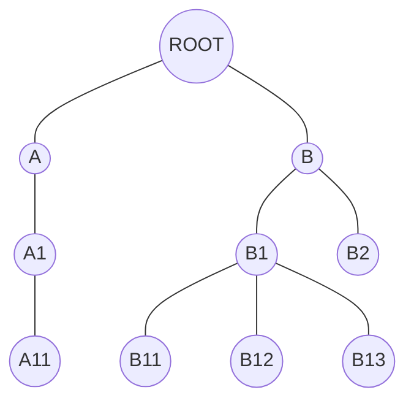
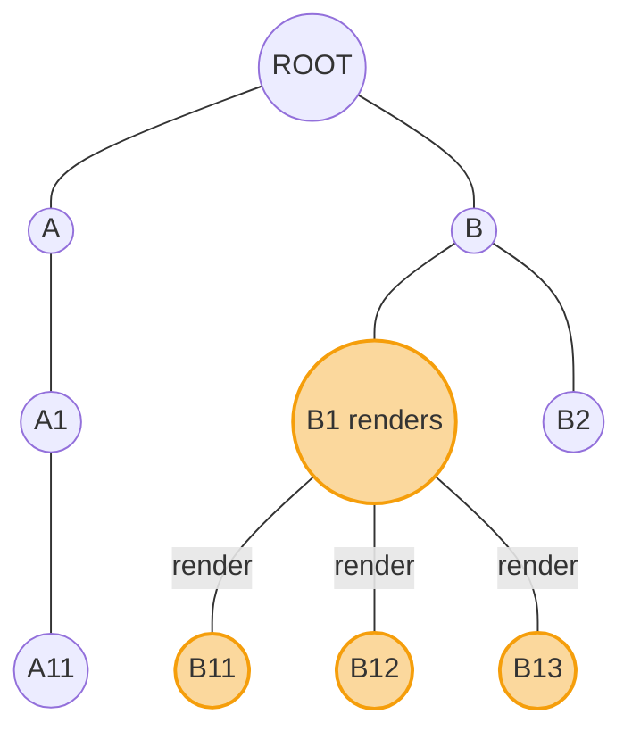
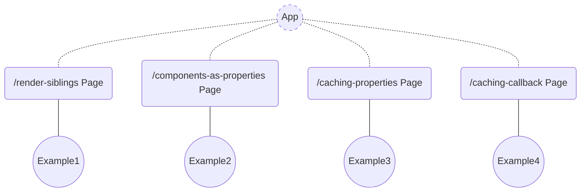
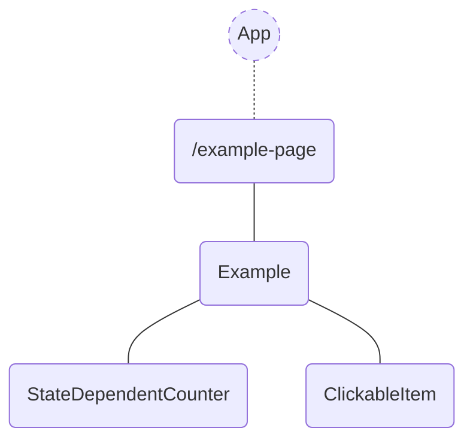

# React 18 vs React 19: Boosting Rendering Performance

## Does performance matter in web apps?

Performance is a crucial aspect of web development. It impacts user experience, search engine optimization (SEO), and
business metrics. A fast and responsive web app keeps users engaged and coming back.

For a deeper dive into web performance best practices, check out this
resource: ["Why speed matters"](https://web.dev/learn/performance/why-speed-matters) from the Chrome Developer Relations
team.

In this article, we'll focus specifically on the rendering performance of React applications composed of various
components. We'll explore what triggers component re-renders and how to minimize it. Finally, we'll examine the impact
of React 19's new compiler on rendering performance.

## Takeaways

- **Component Re-rendering**: Understanding what triggers component re-renders (parent renders, state changes, context changes, hook changes) is crucial for optimizing performance.
- **Optimization Techniques**: Techniques such as avoiding prop drilling, moving non-changing components higher in the tree, moving state closer to its consumers, and using caching hooks like `useMemo` and `useCallback` can help minimize unnecessary re-renders.
- **React 19 Performance Improvements**: React 19 introduces a new compiler that significantly boosts rendering performance by automatically memoizing components and caching internal variables, functions, and hooks.
- **Practical Examples**: The article provides practical examples and comparisons between React 18 and React 19, demonstrating the performance benefits of the new compiler in various scenarios.

## TL;DR

**Just give me the links!**

### Hosted demo web application

> [React 18 Demo](https://main.dev.react-performance-examples.examples.oleksiipopov.com/)

> [React 19 Demo](https://full-rc-upgrade.dev.react-performance-examples.examples.oleksiipopov.com/)

### GitHub

> [react-performance-examples > React 18](https://github.com/AlexeyPopovUA/react-performance-examples)

> [react-performance-examples > React 19 + New compiler](https://github.com/AlexeyPopovUA/react-performance-examples/tree/full-rc-upgrade)

## When do React components re-render?

React components could be composed in an app in form of a tree for rendering:



Many of these elements define nested ones as children or properties. Those can share common properties and state. The
way we define the structure, defines the **rendering scope** and it's **frequency**. These are the cases, which cause
parts of an app to re-render:

* Parent renders
* State changes
* Context changes
* Hook changes

So, if a component renders, then it's children do it as well:



This article will focus on the first two primary causes of re-rendering that represent the influence of components composition.

Re-rendering components can be a performance bottleneck. However, there are ways to mitigate this issue:

* composition schema tuning:
  * avoid [properties drilling](https://www.freecodecamp.org/news/prop-drilling-in-react-explained-with-examples/)
  * move non-changing component definitions higher in the tree and use those as properties (and children)
  * move local state closer to its consumers in the tree
* caching hooks and wrappers for heavy calculations and rendering:
  * [```useMemo```](https://react.dev/reference/react/useMemo)
  * [```React.memo```](https://react.dev/reference/react/memo)
  * [```useCallback```](https://react.dev/reference/react/useCallback)

In React 19 compiler memoizes all components and hooks automatically in local non-shared caches of components. So, the caching hooks and wrappers are not necessary and React 19 simply bypasses them, if they are present.

For illustrative purposes, we'll consider a component with a local state and a shared click handler. The click handler updates the local state, and the component renders nested components. Our goal is to analyze which parts of the component tree re-render in response to state changes and explore optimization techniques.

So the next situations could be modelled:

* re-rendering of children when parent renders
* sharing callbacks between children
* sharing properties between children
* using other components as properties

## Web application with examples

I've implemented a simple multi-page Next.js application using Next.js 14 and React 18. To experiment with React 19, I created a version utilizing Next.js 15RC, React 19RC, and the new compiler. Each page showcases a component composition example.



A typical example page consists of an ```<Example />``` container component with a local state.

This component renders child components that can access properties like state and callbacks from their parent. A ```<ClickableItem />``` component includes a handler that modifies the parent's state, triggering a re-render of ```<Example />```. A ```<StateDependentCounter />``` displays the state value. The primary purpose of the click handler is to induce re-renders of ```<Example />``` and its children.



## Re-rendering of children


> [See the React 18 example page](https://main.dev.react-performance-examples.examples.oleksiipopov.com/examples/re-rendering-siblings/)

> [See the React 19 example page](https://full-rc-upgrade.dev.react-performance-examples.examples.oleksiipopov.com/examples/re-rendering-siblings/)

The actual code:

```tsx
export const Example = () => {
    console.log('Example');

    const [value, setValue] = useState(0);

    return (
        <ExampleBox>
            <StateDependentCounter externalValue={value}/>
            <ClickableItem
                onClick={() => {
                    setValue((v) => v + 1);
                }}
            >
                ClickableItem
            </ClickableItem>
            <StateIndependent/>
            <StateIndependentMemo/>
        </ExampleBox>
    );
};
```

When we click on a ```<ClickableItem />```, we modify the local state of ```<Example />```, which is rendered in the ```<StateDependentCounter />```. 

```<StateIndependent />``` and ```React.memo(StateIndependent)``` components don't depend on that state. Second one is wrapped in ```React.memo```.

Each component outputs its name into console:

| Action          | React 18 (console output)                                                                                     | React 19 + compiler (console output)      |
|:----------------|:--------------------------------------------------------------------------------------------------------------|:------------------------------------------|
| First rendering | Example<br /><br /> StateDependentCounter<br /><br />StateIndependent<br /><br />React.memo(StateIndependent) | the same                                  |
| On click        | Example<br /><br />StateDependentCounter<br /><br />StateIndependent                                          | Example <br /><br />StateDependentCounter |

As observed, after a click, React 18 re-rendered `<Example />`, `<StateDependentCounter />`, `<StateIndependent />`, but not `React.memo(StateIndependent`. `React.memo` returned the previously calculated result after comparing the properties (absent) with ones, present in cache.

In contrast, React 19 rendered only those things, that really changed - `<Example />` and `<StateDependentCounter />`. Nice :smirk: React 19 compiler cached all components automatically.

"On click" rendering screenshot from React DevTools Profiler for React 18


"On click" rendering screenshot from React DevTools Profiler for React 19


## Caching callbacks


> [See the React 18 example page](https://main.dev.react-performance-examples.examples.oleksiipopov.com/examples/caching-callback/)

> [See the React 19 example page](https://full-rc-upgrade.dev.react-performance-examples.examples.oleksiipopov.com/examples/caching-callback/)

```tsx
export const Example = () => {
  console.log('Example');

  const [value, setValue] = useState(0);

  const callback = () => {
    setValue((v) => v + 1);
  };

  const cachedCallback = useCallback(() => {
    setValue((v) => v + 1);
  }, []);

  return (
    <ExampleBox>
      <StateDependentCounter externalValue={value} />
      <CallbackDependent callback={callback} variant="callback" />
      <CallbackDependentCached callback={callback} variant="callback" />
      <CallbackDependent callback={cachedCallback} variant="cachedCallback" />
      <CallbackDependentCached callback={cachedCallback} variant="cachedCallback" />
    </ExampleBox>
  );
};
```

When we click on one of ```<CallbackDependent* variant="*" />``` components, we modify the same local state of ```<Example />```, which is rendered
in the ```<StateDependentCounter />```.

```<CallbackDependent callback={callback} variant="callback"/>``` consumes a regular callback.

```<CallbackDependentCached callback={callback} variant="callback"/>``` is wrapped in ```React.memo``` and consumes a regular callback.

```<CallbackDependent callback={cachedCallback} variant="cachedCallback"/>``` consumes a cached callback.

```<CallbackDependentCached callback={cachedCallback} variant="cachedCallback"/>``` is wrapped in ```React.memo``` and consumes a __cached__ callback.

Each component outputs its name into console:

| Action          | React 18 (console output)                                                                                                                                                                                                                              | React 19 + compiler (console output)       |
|:----------------|:-------------------------------------------------------------------------------------------------------------------------------------------------------------------------------------------------------------------------------------------------------|:-------------------------------------------|
| First rendering | Example <br /><br /> StateDependentCounter <br /><br /> CallbackDependent + callback <br /><br /> React.memo(CallbackDependent) + callback <br /><br /> CallbackDependent + cachedCallback <br /><br /> React.memo(CallbackDependent) + cachedCallback | the same                                   |
| On click        | Example <br /><br /> StateDependentCounter <br /><br /> CallbackDependent + callback <br /><br /> React.memo(CallbackDependent) + callback <br /><br /> CallbackDependent + cachedCallback                                                             | Example <br /><br /> StateDependentCounter |

As observed, after a click, React 18 re-rendered `<Example />`, `<StateDependentCounter />`, `<CallbackDependent callback />`, `<React.memo(CallbackDependent) callback />` and `<CallbackDependent cachedCallback />`, but not `<React.memo(CallbackDependent) cachedCallback />`. It happened because only the last one had all properties correctly cached and left unchanged.

React 19 rendered only those things, that really changed - `<Example />` and `<StateDependentCounter />`. All properties (including callbacks) have been automatically cached.

"On click" rendering screenshot from React DevTools Profiler for React 18


"On click" rendering screenshot from React DevTools Profiler for React 19


## Caching properties


> [See the React 18 example page](https://main.dev.react-performance-examples.examples.oleksiipopov.com/examples/caching-properties/)

> [See the React 19 example page](https://full-rc-upgrade.dev.react-performance-examples.examples.oleksiipopov.com/examples/caching-properties/)

```tsx
export const Example = () => {
  console.log('Example');

  const [value, setValue] = useState(0);

  const cachedCallback = useCallback(() => {
    setValue((v) => v + 1);
  }, []);

  const obj = { test: 123 };
  const objCached = useMemo(() => ({ test: 123 }), []);

  return (
    <ExampleBox>
      <StateDependentCounter externalValue={value} />
      <CallbackDependentCached callback={cachedCallback} variant="cachedCallback" />
      <RenderObject value={obj} variant="RenderObject + obj" />
      <RenderObjectMemo value={obj} variant="React.memo(RenderObject) + obj" />
      <RenderObjectMemo value={objCached} variant="React.memo(RenderObject) + cachedObj" />
      <RenderObjectMemoCompared value={obj} variant="React.memo(RenderObject, isEqual) + obj" />
    </ExampleBox>
  );
};
```

When we click on a ```<CallbackDependentCached />```, we modify the local state of ```<Example />```, which is rendered in the ```<StateDependentCounter />```.

```<RenderObject />```, ```<RenderObjectMemo />``` and ```<RenderObjectMemoCompared />``` consume the same hardcoded ```obj``` object.

```<RenderObjectMemo />``` is simply wrapped with ```React.memo```. ```<RenderObjectMemoCompared />``` is wrapped with ```React.memo``` with a comparator function, that does the deep equality comparison of properties.

Each component outputs its name into console:

| Action          | React 18 (console output)                                                                                                                                                                                                                                                           | React 19 + compiler (console output)      |
|:----------------|:------------------------------------------------------------------------------------------------------------------------------------------------------------------------------------------------------------------------------------------------------------------------------------|:------------------------------------------|
| First rendering | Example <br /><br /> StateDependentCounter<br /><br />React.memo(CallbackDependent) + cachedCallback<br /><br />RenderObject + obj<br /><br /> React.memo(RenderObject) + obj <br /><br /> React.memo(RenderObject) + cachedObj <br /><br />React.memo(RenderObject, isEqual) + obj | the same                                  |
| On click        | Example <br /><br /> StateDependentCounter<br /><br />RenderObject + obj <br /><br /> React.memo(RenderObject) + obj                                                                                                                                                                | Example <br /><br />StateDependentCounter |


As observed, after a click, React 18 re-rendered `<Example />`, `<StateDependentCounter />`, `<RenderObject + obj />` and `<React.memo(RenderObject) + obj />`, but not `<React.memo(CallbackDependent) + cachedCallback />`, `<React.memo(RenderObject) + cachedObj />` and `<React.memo(RenderObject, isEqual) + obj />`.

`<React.memo(CallbackDependent) cachedCallback />` is not rendered, because the callback function is cached via `useCallback` hook and remained the same instance in both rendering jobs.

`<React.memo(RenderObject) + cachedObj />` didn't render because `React.memo` wrapper detected the same object instance in the property `cachedObj` supplied to it.

`<React.memo(RenderObject, isEqual) + obj />` didn't render because of comparator function supplied to `React.memo` wrapper, which did a deep comparison of different instances of the `obj` parameters.

In contrast, React 19 rendered only those things, that really changed - `<Example />` and `<StateDependentCounter />` :open_mouth: . That happened because the `obj` and `cachedObj` objects were automatically cached, so no other components had updates.

"On click" rendering screenshot from React DevTools Profiler for React 18


"On click" rendering screenshot from React DevTools Profiler for React 19


## Components as properties


> [See the React 18 example page](https://main.dev.react-performance-examples.examples.oleksiipopov.com/examples/components-as-properties/)

> [See the React 19 example page](https://full-rc-upgrade.dev.react-performance-examples.examples.oleksiipopov.com/examples/components-as-properties/)

```tsx
export const Example = () => {
  console.log('Example');

  return (
    <SubExample
      externalComponent1={<UsedAsProperty variant="externaly defined" />}
      externalComponent2={<UsedAsChild variant="externaly defined" />}
    />
  );
};

type SubExampleProps = {
  externalComponent1: React.ReactNode;
  externalComponent2: React.ReactNode;
};

export const SubExample = (props: SubExampleProps) => {
  console.log('SubExample');

  const [value, setValue] = useState(0);

  const cachedCallback = useCallback(() => {
    setValue((v) => v + 1);
  }, []);

  return (
    <ExampleBox>
      <StateDependentCounter externalValue={value} />
      <ClickableItem onClick={cachedCallback}>ClickableItem</ClickableItem>
      <RenderComponent
        propComponent={<UsedAsProperty variant="defined near the consumer" />}
        variant="RenderComponent propComponent={<UsedAsProperty />}"
      />
      <RenderComponent
        propComponent={props.externalComponent1}
        variant="RenderComponent propComponent={props.externalComponent}"
      />
      <RenderComponent
        propComponent={props.externalComponent1}
        variant="RenderComponent propComponent={props.externalComponent} + children"
      >
        {props.externalComponent2}
      </RenderComponent>
    </ExampleBox>
  );
};
```

```<Example />```  renders ```<SubExample />``` component and sets ```<UsedAsProperty />``` and ```<UsedAsChild />``` as its properties.

When we click on a ```<CallbackDependentCached />```, we modify the local state of ```<SubExample />```, which is rendered in the ```<StateDependentCounter />```.

The first ```<RenderComponent``` uses locally defined ```<UsedAsProperty />``` as a property.

The second ```<RenderComponent />``` uses externally defined ```<UsedAsProperty />``` as a property.

The third ```<RenderComponent />``` uses externally defined ```<UsedAsProperty />``` as a property and externally defined ```<UsedAsChild />``` as a child.

Each component outputs its name into console:

| Action          | React 18 (console output)                                                                                                                                                                                                                                                                                                                                                                                                                                                                      | React 19 + compiler (console output)       |
|:----------------|:-----------------------------------------------------------------------------------------------------------------------------------------------------------------------------------------------------------------------------------------------------------------------------------------------------------------------------------------------------------------------------------------------------------------------------------------------------------------------------------------------|:-------------------------------------------|
| First rendering | Example <br /><br /> SubExample <br /><br /> StateDependentCounter <br /><br /> RenderComponent propComponent=\{\<UsedAsProperty />\} <br /><br /> UsedAsProperty defined near the consumer <br /><br /> RenderComponent propComponent=\{props.externalComponent\} <br /><br /> UsedAsProperty externally defined <br /><br /> RenderComponent propComponent=\{props.externalComponent\} + children <br /><br /> UsedAsProperty externally defined <br /><br /> UsedAsChild externally defined | the same                                   |
| On click        | SubExample <br /><br /> StateDependentCounter <br /><br /> RenderComponent propComponent=\{\<UsedAsProperty />\} <br /><br /> UsedAsProperty defined near the consumer <br /><br /> RenderComponent propComponent=\{props.externalComponent\} <br /><br /> RenderComponent propComponent=\{props.externalComponent\} + children                                                                                                                                                                | Example <br /><br /> StateDependentCounter |

Well... it looks like a lot to explain.

If looking carefully, we notice 1 new important effect in React 18 rendering logs, that demonstrates importance of a good components composition, using them as properties and children (in fact, it is the same). Components, defined closer to the root, outside their updating parent, don't re-render. Those were rendered earlier. That's the case, when the next practice is justified "move non-changing component definitions higher". Components as properties, defined together with their consumer, render again.

Not a big surprise to see, that the brilliant React 19 compiler rendered only a tiny peace. Everything is cached. Yep. As simple as that.

"On click" rendering screenshot from React DevTools Profiler for React 18


"On click" rendering screenshot from React DevTools Profiler for React 19


## Why React 19 with it's new compiler is so good in terms of performance?

* Auto-memoization of all components
* Internal component caching of variables, functions and hooks
* Basically, components are re-written by compiler in such a way, so all internal elements are defined once and re-rendering does not create new instances of those (remember `useCallback(() => dosmthWithDeps(), deps)`) and does not cause rendering waterfall for consumers

## Conclusions

In this article, we reviewed various component compositions and methods to minimize rendering jobs.

We examined the impact of React 19 and its new compiler on rendering performance, noting a significant improvement in rendering speed for projects without or with insufficient caching.

Theoretically, once we upgrade to React 19, we can eliminate all caching hooks and wrappers from React 18. However, there is no immediate urgency to do so, as the compiler will handle all cases appropriately.