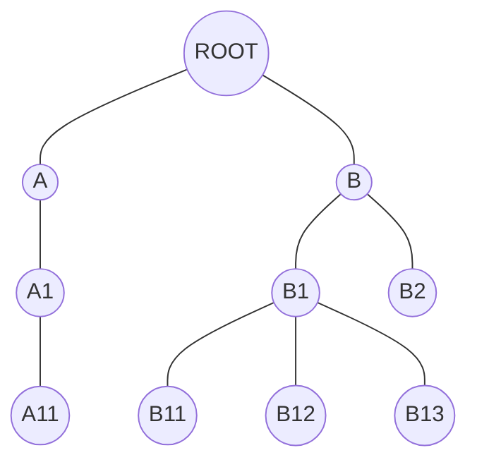
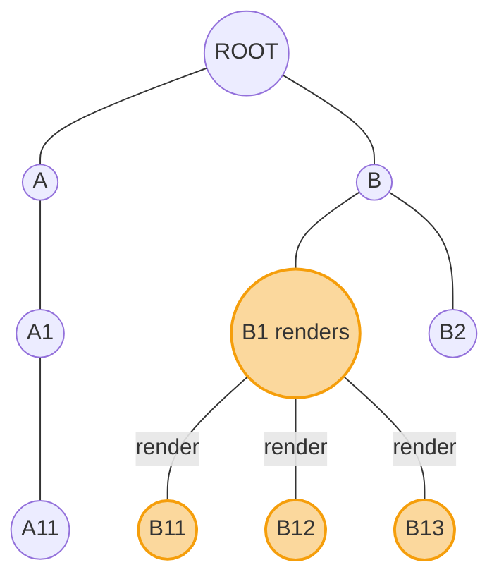
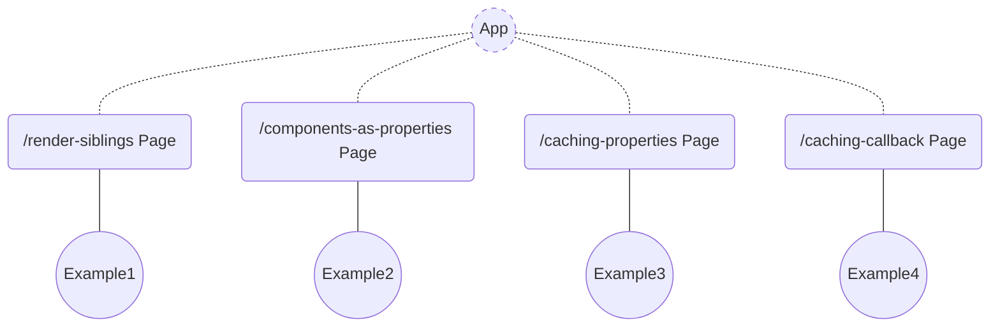
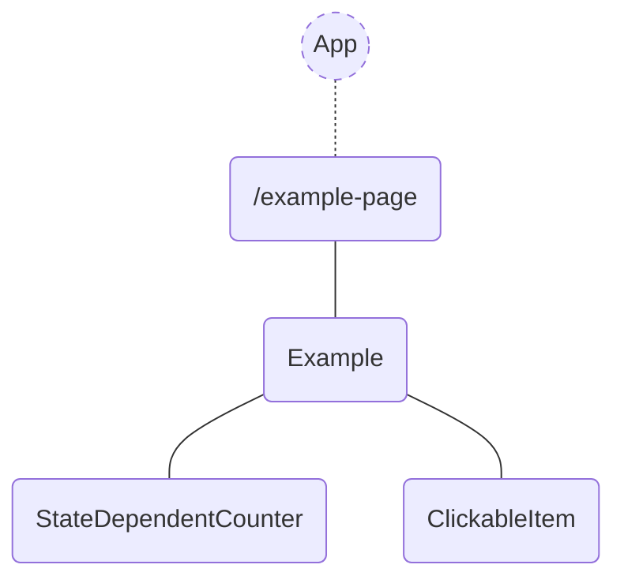

# Impact of React 19 and its new compiler on the performance of web apps

## Does performance matter in web apps?

Performance is a crucial aspect of web development. It impacts user experience, search engine optimization (SEO), and
business metrics. A fast and responsive web app keeps users engaged and coming back.

For a deeper dive into web performance best practices, check out this
resource: ["Why speed matters"](https://web.dev/learn/performance/why-speed-matters) from the Chrome Developer Relations
team.

In this article, we'll focus specifically on the rendering performance of React applications composed of various
components. We'll explore what triggers component re-renders and how to minimize them. Finally, we'll examine the impact
of React 19's new compiler on rendering performance.

## TL;DR

**Just give me the links!**

### Hosted demo web application

> [React 18 Demo](https://main.dev.react-performance-examples.examples.oleksiipopov.com/)

> [React 19 Demo](https://full-rc-upgrade.dev.react-performance-examples.examples.oleksiipopov.com/)

### GitHub

> [react-performance-examples > React 18](https://github.com/AlexeyPopovUA/react-performance-examples)

> [react-performance-examples > React 19 + New compiler](https://github.com/AlexeyPopovUA/react-performance-examples/tree/full-rc-upgrade)

## When do React components re-render?

React components could be combined in an app in form of tree for rendering:



Many of these elements define nested ones as children or properties. Those can share common properties and state. The
way we define the structure, defines the **rendering scope** and it's **frequency**. These are the cases, which cause
parts of an app to re-render:

* Parent renders
* State changes
* Context changes
* Hook changes

So, if a component renders, then it's children do it as well:



Re-rendering of components may be an expensive job sometimes, but there are ways to improve that.

In this article we will pay special attention to first 2 rendering reasons, that represent the influence of components composition.

As a typical situation for all examples, we will consider a component, that contains local state and shared click handler. Click handler is supposed to modify the local state. This component also renders nested components. And this is what we want to check - what renders when the state changes and how to reduce these activities.

So the next situations could be modelled:

* re-rendering of siblings
* sharing callbacks
* sharing properties
* using other components as properties

## Web application with examples

I have implemented a simple multi-page Next.js application, using Next.js 14 and React 18. Each page contains a component composition example.



The typical example page consists of an ```<Example />``` container, that has local state. Example renders children, that may or may not take properties from their parent, like state, callbacks etc. ```<ClickableItem />``` has a handler that modifies the state and triggers re-rendering of ```<Example />```. ```<StateDependentCounter />``` shows the state value. The purpose of click handler is to trigger rendering loop of ```<Example />``` and its children.



## Re-rendering of sibling components


When we click on a ClickableItem, we modify the local state of ExampleBox, which is rendered in
the ```<StateDependentCounter />```. ```<StateIndependent />``` and ```React.memo(StateIndependent)``` component don't
depend on hat state. Second one is wrapped in ```React.memo```.

The actual code:

```tsx
export const Example = () => {
    console.log('Example');

    const [value, setValue] = useState(0);

    return (
        <ExampleBox>
            <StateDependentCounter externalValue={value}/>
            <ClickableItem
                onClick={() => {
                    setValue((v) => v + 1);
                }}
            >
                ClickableItem
            </ClickableItem>
            <StateIndependent/>
            <StateIndependentMemo/>
        </ExampleBox>
    );
};
```


| Action          | React 18 (console output)                                                                     | React 19 + compiler (console output) |
|:----------------|:----------------------------------------------------------------------------------------------|:-------------------------------------|
| First rendering | Example <br /> StateDependentCounter<br />StateIndependent<br />React.memo(StateIndependent)  | the same                             |
| On click        | Example<br />StateDependentCounter<br />StateIndependent                                      | Example <br />StateDependentCounter  |


## Caching properties


```tsx
export const Example = () => {
    console.log('Example');

    const [value, setValue] = useState(0);

    const callbackCached = useCallback(() => {
        setValue((v) => v + 1);
    }, []);

    const obj = {test: 123};

    return (
        <ExampleBox>
            <StateDependentCounter externalValue={value}/>
            <CallbackDependentCached callback={callbackCached} variant="callbackCached"/>
            <RenderObject value={obj} variant="RenderObject"/>
            <RenderObjectMemo value={obj} variant="RenderObjectMemo"/>
            <RenderObjectMemoCompared value={obj} variant="RenderObjectMemoCompared"/>
        </ExampleBox>
    );
};
```


| Action          | React 18 (console output)                                                                                                                                                                                                                                       | React 19 + compiler (console output) |
|:----------------|:----------------------------------------------------------------------------------------------------------------------------------------------------------------------------------------------------------------------------------------------------------------|:-------------------------------------|
| First rendering | Example <br /> StateDependentCounter<br />React.memo(CallbackDependent) callbackCached<br />RenderObject \{"test":123\} <br /> RenderObjectMemo \{"test":123\} Option: RenderObjectMemo <br /> RenderObjectMemo \{"test":123\} Option: RenderObjectMemoCompared | the same                             |
| On click        | Example <br /> StateDependentCounter<br />RenderObject \{"test":123\} <br /> RenderObjectMemo  \{"test":123\} Option: RenderObjectMemo                                                                                                                          | Example <br />StateDependentCounter  |


TODO Explain

"On click" rendering screenshot from React DevTools Profiler for React 18


"On click" rendering screenshot from React DevTools Profiler for React 19


TODO Explain the difference

## Caching callbacks


```tsx
export const Example = () => {
    console.log('Example');

    const [value, setValue] = useState(0);

    const sharedCallback = () => {
        setValue((v) => v + 1);
    };

    const sharedCallbackCached = useCallback(() => {
        setValue((v) => v + 1);
    }, []);

    return (
        <ExampleBox>
            <StateDependentCounter externalValue={value}/>
            <CallbackDependent callback={sharedCallback} variant="sharedCallback"/>
            <CallbackDependentCached callback={sharedCallback} variant="sharedCallback"/>
            <CallbackDependent callback={sharedCallbackCached} variant="sharedCallbackCached"/>
            <CallbackDependentCached callback={sharedCallbackCached} variant="sharedCallbackCached"/>
        </ExampleBox>
    );
};
```

| Action          | React 18 (console output)                                                                                                                                                                                                                | React 19 + compiler (console output) |
|:----------------|:-----------------------------------------------------------------------------------------------------------------------------------------------------------------------------------------------------------------------------------------|:-------------------------------------|
| First rendering | Example <br /> StateDependentCounter <br /> CallbackDependent sharedCallback <br /> React.memo(CallbackDependent) sharedCallback <br /> CallbackDependent sharedCallbackCached <br /> React.memo(CallbackDependent) sharedCallbackCached | the same                             |
| On click        | Example <br /> StateDependentCounter <br /> CallbackDependent sharedCallback <br /> React.memo(CallbackDependent) sharedCallback <br /> CallbackDependent sharedCallbackCached                                                           | Example <br /> StateDependentCounter |


"On click" rendering screenshot from React DevTools Profiler for React 18


TODO Explain

"On click" rendering screenshot from React DevTools Profiler for React 19


TODO Explain the difference

## Components as properties


```tsx
export const Example = () => {
    console.log('Example');

    return (
        <SubExample
            externalComponent1={<IAmUsedAsAsAProperty variant="externaly defined"/>}
            externalComponent2={<IAmUsedAsAsAChild variant="externaly defined"/>}
        />
    );
};

type SubExampleProps = {
    externalComponent1: React.ReactNode;
    externalComponent2: React.ReactNode;
};

export const SubExample = (props: SubExampleProps) => {
    console.log('SubExample');

    const [value, setValue] = useState(0);

    const sharedCallbackCached = useCallback(() => {
        setValue((v) => v + 1);
    }, []);

    return (
        <ExampleBox>
            <StateDependentCounter externalValue={value}/>
            <ClickableItem onClick={sharedCallbackCached}>ClickableItem</ClickableItem>
            <RenderComponentAsAProperty
                propComponent={<IAmUsedAsAsAProperty variant="defined near the consumer"/>}
                variant="RenderComponentAsAProperty propComponent={<IAmUsedAsAsAProperty />}"
            />
            <RenderComponentAsAProperty
                propComponent={props.externalComponent1}
                variant="RenderComponentAsAProperty propComponent={props.externalComponent}"
            />
            <RenderComponentAsAProperty
                propComponent={props.externalComponent1}
                variant="RenderComponentAsAProperty propComponent={props.externalComponent} + children"
            >
                {props.externalComponent2}
            </RenderComponentAsAProperty>
        </ExampleBox>
    );
};
```


| Action          | React 18 (console output)                                                                                                                                                                                                                                                                                                                                                                                                                                                                                                                                                                | React 19 + compiler (console output) |
|:----------------|:-----------------------------------------------------------------------------------------------------------------------------------------------------------------------------------------------------------------------------------------------------------------------------------------------------------------------------------------------------------------------------------------------------------------------------------------------------------------------------------------------------------------------------------------------------------------------------------------|:-------------------------------------|
| First rendering | Example <br /> SubExample <br /> StateDependentCounter <br /> RenderComponentAsAProperty RenderComponentAsAProperty propComponent=\{\<IAmUsedAsAsAProperty />\} <br /> IAmUsedAsAsAProperty defined near the consumer <br /> RenderComponentAsAProperty RenderComponentAsAProperty propComponent=\{props.externalComponent\} <br /> IAmUsedAsAsAProperty externally defined <br /> RenderComponentAsAProperty RenderComponentAsAProperty propComponent=\{props.externalComponent\} + children <br /> IAmUsedAsAsAProperty externally defined <br /> IAmUsedAsAsAChild externally defined | the same                             |
| On click        | SubExample <br /> StateDependentCounter <br /> RenderComponentAsAProperty RenderComponentAsAProperty propComponent=\{\<IAmUsedAsAsAProperty />\} <br /> IAmUsedAsAsAProperty defined near the consumer <br /> RenderComponentAsAProperty RenderComponentAsAProperty propComponent=\{props.externalComponent\} <br /> RenderComponentAsAProperty RenderComponentAsAProperty propComponent=\{props.externalComponent\} + children                                                                                                                                                          | Example <br /> StateDependentCounter |


"On click" rendering screenshot from React DevTools Profiler for React 18


TODO Explain

"On click" rendering screenshot from React DevTools Profiler for React 19


TODO Explain the difference

## Why React 19 with the new compiler are so good?

* Auto-wrapping with `memo`
* Internal component caching
* Compiled component is transformed, so all callbacks are defined once for all rendering calls

## Conclusions

We reviewed several component compositions and ways to minimize the rendering jobs.
We checked the impact of React 19 and the new compiler on rendering performance.
What can we get rid of when updating?
