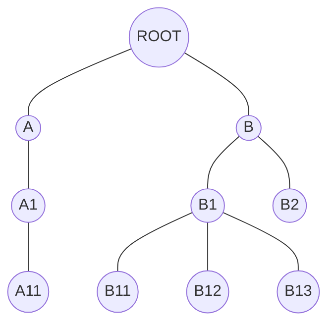
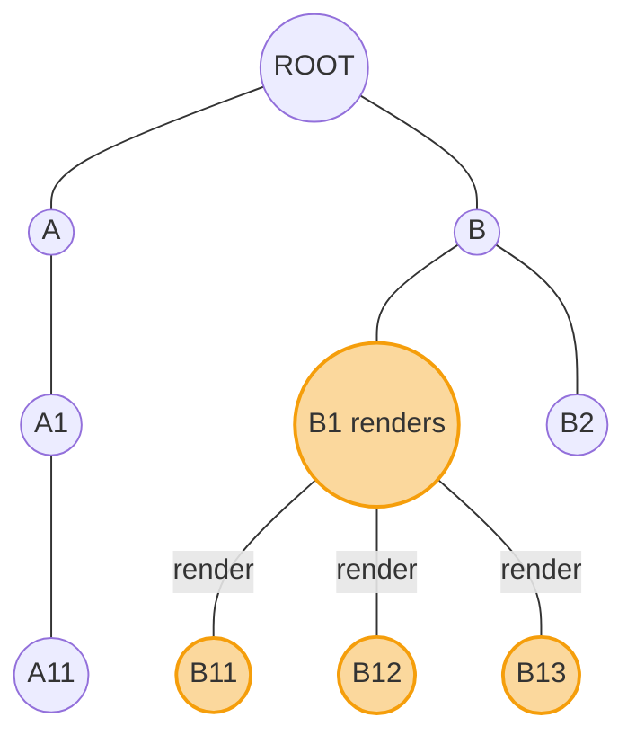
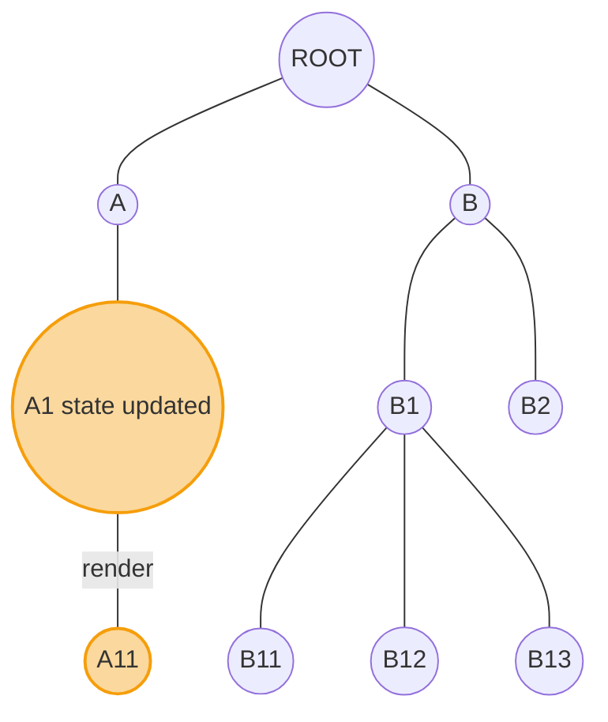
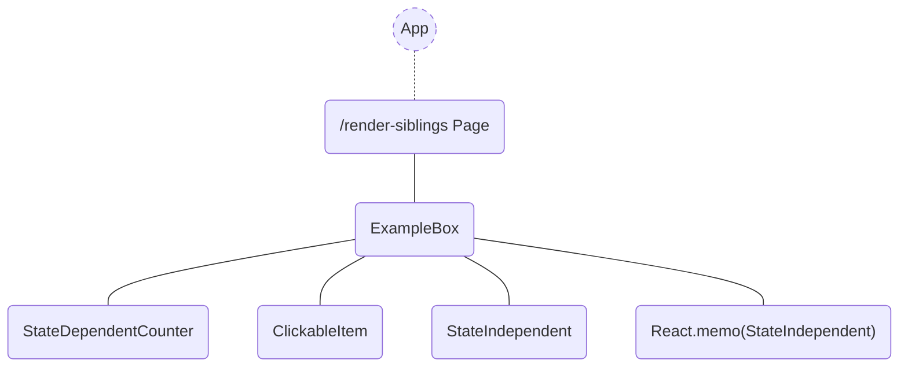

# Why my React components re-render?

## Performance is a thing

The topic of performance in web development is much wider than reflection of personal feelings. It is a complex of
analytical and software development technics, that has a real influence on business metrics. If you need a proof, have a
look at the short article ["Why speed matters"](https://web.dev/learn/performance/why-speed-matters) from the Chrome
Developer Relations team.

Purpose of this article is to explore a tiny piece of this topic, dedicated to rendering of a React application of
different components compositions. Let's check what causes application parts to re-render and what helps to reduce it.
As a bonus section, we will see the impact of the latest release candidate React 19, and it's brand-new compiler.

## When performance improvement is necessary?

### My application exists

Before diving into this topic deeper, lets try to be honest with ourselves. Is performance the biggest issue now, or
you're just bored?

To help you find this out, I would ask you next questions:

- Does your team have time to speak about performance, or they are completely swamped in other high priority issues?
  Please, start from those. It is either too early or too late. You're probably burning already

- Does it take seconds for your website hosting to serve the small index.html file? Please start from that

- Is your page a big fat 50MB collection of html, scripts, styles and images? Please start from that

We need to be practical. If the biggest performance issue of you web application is actually in its responsiveness
during the visitor workflow, then this article might be useful.

### I start a new one

That's a luxury! Performance can be a permanent part of you thinking process, not necessary an emergency measure.
Rendering effectiveness of React applications in particular is strongly dependent on its structure. So keeping it in
mind, it is easier to avoid common problems.

### Long story short

Fixing React application structure may give you the biggest performance boost, if other problems have a smaller impact.

## React components composition

React components could be combined in an app in form of tree for rendering:



Many of these elements define nested ones as children or properties. Those can share common properties and state. The
way we define the structure, defines the **rendering scope** and it's **frequency**. Let's review cases, which cause
parts of an app to re-render:

* Parent renders
* State changes
* Context changes
* Hook changes

In this article we will pay special attention to the simplest first 2, that represent the influence of components
composition on the rendering performance.

So, if parent renders, then it's children do it as well:



If component state changes, it renders:



As a typical situation for all examples, we will consider a component, that contains local state and shared click
handler. Click handler is supposed to modify the local state. This component also renders nested components. And this is
what we want to check - what renders when the state changes and how to reduce these activities.

So the next situations could be modelled:

* re-rendering of siblings
* sharing callbacks
* sharing properties
* using other components as properties

## Web application with examples

I have implemented a simple multi page NextJS application. Each page contains a components composition example.

The typical example page consists of an ```<ExampleBox />``` container, that has local state. ExampleBox renders
children, that may or may not take properties from their parent, like state, callbacks etc. One child has a handler that
modifies the state and triggers re-rendering of ExampleBox. ```<StateDependentCounter />``` shows the state value. The
purpose of click handler is to trigger rendering loop of ```<ExampleBox />``` and its children. Our main goal is to find
out when and why children re-render and how to avoid it.

Please note, that current demo just shows the basic use cases and in practice such cases don't need any performance
improvements.


Its simplified structure is



When we click on a ClickableItem, we modify the local state of ExampleBox, which is rendered in the ```<StateDependentCounter />```. ```<StateIndependent />``` and ```React.memo(StateIndependent)``` component don't depend on hat state. Second one is wrapped in ```React.memo```.

The actual code:

```tsx
export const Example = () => {
  console.log('Example');

  const [value, setValue] = useState(0);

  return (
          <ExampleBox>
            <StateDependentCounter externalValue={value}/>
            <ClickableItem
                    onClick={() => {
                      setValue((v) => v + 1);
                    }}
            >
              ClickableItem
            </ClickableItem>
            <StateIndependent/>
            <StateIndependentMemo/>
          </ExampleBox>
  );
};
```


## Conclusion

