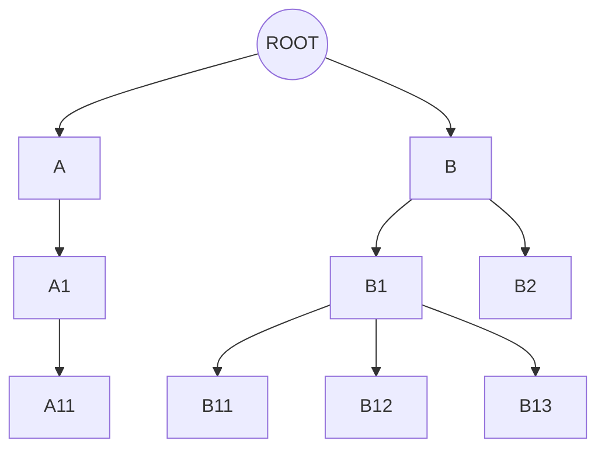

## Performance is a thing

The topic of performance in web development is much wider than reflection of personal feelings. It is a complex of analytical and software development technics, that has a real influence on business metrics. If you need a proof, start from the article ["Why speed matters"](https://web.dev/learn/performance/why-speed-matters) from the Chrome Developer Relations team.

Purpose of this article is to explore a tiny peace of this topic, dedicated to rendering of a React application of different components compositions. Lets check what causes application parts to re-render and what helps to reduce it. As a bonus section, we will see the impact of the latest release candidate React 19 and it's brand new compiler.

## React components composition

React components could be combined in an app in form of tree for rendering:

TODO Image of a component tree

Many of these elements define nested ones as children or properties. Those can share common properties and state. The way we define the structure, defines the rendering scope and it's frequency. Lets review cases, which cause parts of an app to re-render:
* Parent renders
* State changes
* Context changes
* Hook changes

In this article we will pay special attention to the simplest first 2, that represent the influence of components composition on the rendering performance.

As a typical situation for all examples, we will consider a component, that contains local state and shared click handler. Click handler is supposed to modify the local state. This component also renders nested components. And this is what we want to check - what renders when the state changes and how to reduce these activities.

So the next situations could be modelled:
* re-rendering of siblings
* sharing callbacks
* sharing properties
* using other components as properties

## Web application with examples

I have implemented a simple multi page NextJS application. Each page contains a components composition example.

## Conclusion

