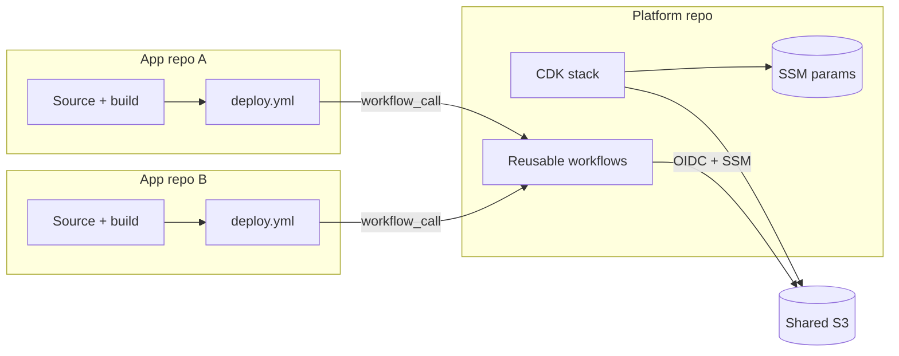
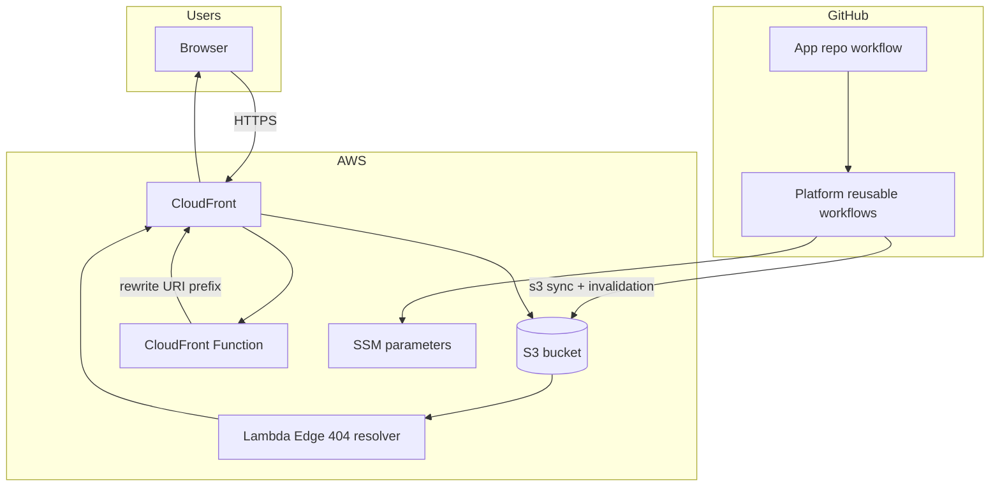
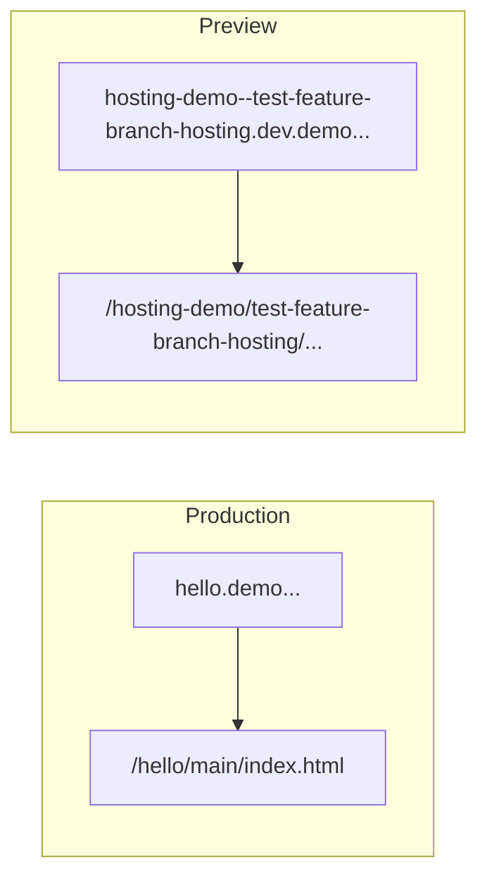
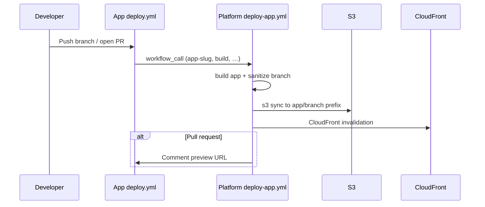
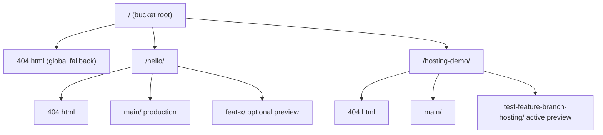

# Static hosting for vibe coders: one platform, many apps

## Why I built this

While working on a dev platform, we once got a request that sounded simple on the surface: a **super lightweight “vibe coding” space** — friendly for **non-technical people** who wanted to sketch an idea quickly and **see it live** without learning deployment tooling.

There was no formal spec. The practical bar was roughly:

- make it **easy for an AI agent** to use end-to-end;
- when the agent finishes a change, **hand back a demo link**;
- let people **iterate** on that link until the idea is good enough.

That idea stuck with me, but **this article is not about what we shipped at work**. The team eventually took a different road — a heavier stack that kept picking up “one more technology” as requirements shifted late in the game. Fair enough for that context; it just was not the minimal static-hosting shape I had in mind.

**This platform is a private experiment** on my own time and AWS account: a way to satisfy builder curiosity and see how small the solution could stay while still feeling useful. Same spark, different constraints — optimize for cheap, boring, and agent-friendly instead of covering every platform feature on day one.

At its core it is still a hosting problem dressed as a product ask: you need a URL fast, you need previews while experimenting, and you do not want every experiment to become its own infrastructure project.

### From one app to many

A few years earlier I had built [static hosting with a protected dev environment](/blog/simple-static-web-hosting-aws-infrastructure-with-protected-dev-environment/) — **one** app, **multiple environments**, and preview-style URLs on a dev subdomain. It was simple, cheap, and dynamic enough for feature work.

That design stuck in my head. The new question was:

> What if we had the same **preview-by-branch** idea, but for **any number** of small static apps — not just one codebase?

That became this platform: still boring on purpose (S3 + CloudFront + GitHub Actions), but scaled out to **many tenants** with almost no ceremony per app. The [older article’s conclusion](/blog/simple-static-web-hosting-aws-infrastructure-with-protected-dev-environment/#conclusions) already listed “dynamic subdomains” and “proper browser routing” as likely follow-ups — this is that evolution, with public preview URLs instead of a WAF-protected dev distribution.

### What this is — and is not

This is a **static hosting platform**, not a full-stack product:

- **In scope:** HTML/CSS/JS (or any build that outputs static files), branch previews, shared infra, thin app repos.
- **Out of scope:** APIs, databases, auth backends, server-side runtimes. If you need a backend, you bring it elsewhere.

The goal is “draft, deploy, share a link, iterate” — not “run my entire SaaS here.”

### What shipped

- **Many apps** on the same infrastructure (one S3 bucket, one CloudFront distribution).
- **Clean URLs** per app: `{app}.demo.oleksiipopov.com` for production.
- **Branch previews** on pull requests: `{app}--{branch}.dev.demo.oleksiipopov.com`.
- **Separate Git repos** per app — the platform repo only owns AWS and reusable workflows.

The code lives in two places:

- Platform (infra + workflows): [static-hosting-for-vibe-coders](https://github.com/AlexeyPopovUA/static-hosting-for-vibe-coders)
- External demo consumer: [static-hosting-demo-app](https://github.com/AlexeyPopovUA/static-hosting-demo-app)

Live examples today on `demo.oleksiipopov.com`:

| App | Type | Production URL |
|-----|------|----------------|
| `hello` | Bundled with platform CDK | [hello.demo.oleksiipopov.com](https://hello.demo.oleksiipopov.com) |
| `palette` | Bundled with platform CDK | [palette.demo.oleksiipopov.com](https://palette.demo.oleksiipopov.com) |
| `hosting-demo` | External repo + reusable workflow | [hosting-demo.demo.oleksiipopov.com](https://hosting-demo.demo.oleksiipopov.com) |
| `hosting-demo` (branch preview) | Same app, PR deploy | [hosting-demo--test-feature-branch-hosting.dev.demo.oleksiipopov.com](https://hosting-demo--test-feature-branch-hosting.dev.demo.oleksiipopov.com) |

## The idea: one platform, many thin app repos

The whole design rests on a simple split:

| Layer | Owns | Where it lives |
|-------|------|----------------|
| **Platform** | Shared S3 bucket, one CloudFront distribution, wildcard DNS, subdomain → prefix routing, branch sanitization, cache invalidation, PR preview comments | [static-hosting-for-vibe-coders](https://github.com/AlexeyPopovUA/static-hosting-for-vibe-coders) |
| **App** | Source code, build (`pnpm build` → `dist/`), deploy triggers | One Git repo per demo (e.g. [static-hosting-demo-app](https://github.com/AlexeyPopovUA/static-hosting-demo-app)) |

An app repo does **not** copy CDK stacks, bucket names, or distribution IDs. It adds a short `deploy.yml` that calls the platform’s reusable `deploy-app.yml` via GitHub Actions `workflow_call`, passes its `app-slug` and build settings, and inherits the shared OIDC role. Everything after that — build, upload, cache invalidation, preview URL comment — runs inside the platform workflow; app authors never add extra checkout steps or platform code to their repo.

That is the same spine as my [older single-app static hosting setup](/blog/simple-static-web-hosting-aws-infrastructure-with-protected-dev-environment/) (GitHub Actions → S3 → CloudFront), evolved for a different shape: **many tenants**, **subdomain URLs per app**, and **deploy logic maintained once** instead of duplicated per repository. Where that article used two distributions and a WAF-gated dev host for one codebase, this platform uses one distribution and public preview subdomains so every new demo is mostly “pick a slug, add YAML, push.”



Bundled `hello` and `palette` apps inside the CDK package prove routing after infra changes without any external repo. A real consumer like `hosting-demo` proves the reusable-workflow path — the integration surface every new demo app is meant to copy.

## What I needed (requirements)

The **user-facing** requirements were almost embarrassingly small:

| Ask | How the platform answers it |
|-----|-----------------------------|
| “Give me a link when you’re done” | Production URL per app slug; PR workflow posts a preview URL in a comment |
| “Let me iterate” | Each branch/PR gets its own subdomain and S3 prefix |
| “Keep it simple for agents” | App repo adds a short reusable workflow; build is `pnpm build` → upload `dist/` |

From that, a few **technical** requirements fell out:

1. **Multi-tenant static hosting** — many small apps, each with its own slug, without a new CloudFront distribution per app.
2. **Production vs preview** — default branch is production; every PR gets an isolated preview folder and URL.
3. **Predictable URLs** — wildcards on DNS and ACM: `*.demo.oleksiipopov.com` and `*.dev.demo.oleksiipopov.com`.
4. **Safe names** — Git branch names like `feature/login` must become DNS-safe (`feature-login`).
5. **SPA-friendly 404s** — ship `404.html` alongside `index.html` so client-side routers still work.
6. **Simple app integration** — `deploy.yml` + optional `cleanup.yml`; no platform code copied into every repo.
7. **Automatic cleanup** — when a remote branch is deleted, remove the S3 prefix so previews do not pile up.
8. **Low cost and low ops** — one bucket, one distribution, OIDC from GitHub Actions (no long-lived keys in app repos).

**Explicit non-goals:** backends, databases, per-app auth, custom domains per app, and per-app `Cache-Control` tuning (shared deploy workflows invalidate CloudFront after upload instead). This stays a **static** lane on purpose.

## Architecture at a glance

Visitors always hit **one CloudFront distribution**. A **CloudFront Function** (viewer-request) reads the `Host` header and rewrites the URI to an S3 prefix. **Lambda@Edge** (origin-response) only helps with HTML-style 404 handling by serving the closest `404.html` inline.



### Infra IDs in SSM

The `PW --> SSM` arrow is how reusable workflows learn **where** to upload and **what** to invalidate. When CDK deploys the platform stack, it writes two Parameter Store values:

| Parameter | Value |
|-----------|--------|
| `/static-hosting/bucket-name` | Shared S3 bucket name |
| `/static-hosting/distribution-id` | CloudFront distribution ID |

App repos do **not** copy those IDs into GitHub secrets. They call `deploy-app.yml` (or `cleanup-branch.yml` / `invalidate-app.yml`) with `secrets: inherit`; the workflow assumes the shared OIDC role, runs `aws ssm get-parameter` for each path, then uses the results for `s3 sync` and `create-invalidation`.

That keeps a single source of truth in AWS: if infra is recreated, updating the parameters is enough — every consumer workflow keeps working without editing each app repo. Apps only pass **their** inputs (`app-slug`, `output-dir`, `base-domain`, …).

### URL → S3 mapping

Production uses a short hostname. Previews use a **single DNS label** with `--` between app and branch (so `*.dev.demo...` wildcard still works).

| URL | S3 prefix (example) |
|-----|---------------------|
| `hello.demo.oleksiipopov.com` | `/hello/main/` |
| `hello--feat-ui.dev.demo.oleksiipopov.com` | `/hello/feat-ui/` |
| `hosting-demo.demo.oleksiipopov.com` | `/hosting-demo/main/` |
| `hosting-demo--test-feature-branch-hosting.dev.demo.oleksiipopov.com` | `/hosting-demo/test-feature-branch-hosting/` |



Branch names are sanitized in CI (slashes and odd characters become hyphens, lowercased, max 63 chars). The separator `--` is reserved: app slugs and branch names cannot contain `--` themselves.

### Closest 404 (HTML only)

For navigation requests (no file extension, `.html`, or `Accept: text/html`), a miss in S3 triggers a search:

1. `/{app}/{branch}/404.html`
2. `/{app}/404.html`
3. `/404.html` (global)

The first existing file is returned with HTTP 404 and the HTML body — no redirect. Static assets (`.js`, `.css`, images) keep a normal 404 from origin.

**SPA tip:** ship `404.html` as a copy of `index.html` in each deploy. The external demo app build does this automatically.

### What we deliberately avoid

CloudFront **custom error responses** are **not** configured on the distribution. They would fight with the Lambda@Edge resolver.

## Reusable workflows: what app repos actually add

The integration surface is deliberately boring. Your repo declares **when** to run, **permissions**, and **parameters** — then calls a platform workflow with `uses: …/deploy-app.yml@main`. No extra steps, no platform code in the app tree.

The platform exposes three callable workflows:

| Platform workflow | Typical trigger in app repo | What you pass |
|-------------------|----------------------------|---------------|
| `deploy-app.yml` | `push` to `main`, `pull_request` | `app-slug`, `build-command`, `output-dir`, `base-domain` |
| `cleanup-branch.yml` | `delete` (remote branch removed) | `app-slug`, `branch` |
| `invalidate-app.yml` | Manual (optional) | `app`, optional `branch` |

A real consumer looks like [static-hosting-demo-app](https://github.com/AlexeyPopovUA/static-hosting-demo-app). The entire deploy workflow is:

```yaml
name: Deploy

on:
  push:
    branches: [main]
  pull_request:

permissions:
  id-token: write
  contents: read
  pull-requests: write

jobs:
  deploy:
    uses: AlexeyPopovUA/static-hosting-for-vibe-coders/.github/workflows/deploy-app.yml@main
    with:
      app-slug: hosting-demo
      build-command: pnpm build
      output-dir: dist
      base-domain: demo.oleksiipopov.com
    secrets: inherit
```

Branch cleanup is the same pattern — one job, parameters only:

```yaml
name: Cleanup

on:
  delete:

permissions:
  id-token: write
  contents: read

jobs:
  cleanup:
    if: github.event.ref_type == 'branch'
    uses: AlexeyPopovUA/static-hosting-for-vibe-coders/.github/workflows/cleanup-branch.yml@main
    with:
      app-slug: hosting-demo
      branch: ${{ github.event.ref }}
    secrets: inherit
```

That is the whole contract from an app author’s view:

- **`with:`** — your app identity and build settings (`app-slug` must be unique on the platform; branch names are sanitized inside the platform workflow, e.g. `test/feature-branch-hosting` → `test-feature-branch-hosting`).
- **`secrets: inherit`** — forwards the shared `AWS_AUTH_ROLE` GitHub variable for OIDC. Bucket and distribution IDs stay out of app repos; the platform workflow reads them from SSM (see [Infra IDs in SSM](#infra-ids-in-ssm)).
- **`uses: …@main`** — pin a tag or SHA when you want stricter upgrade control.

Build, `s3 sync`, CloudFront invalidation, and the PR preview comment all happen inside `deploy-app.yml`. You do not configure those steps locally.

Compared to the [older hosting repo](https://github.com/AlexeyPopovUA/simple-hosting), where infra and app lived together and branch deploys were path-based on one dev hostname, **workflow logic now lives in the platform once**. Each new demo is a new repository with the same two YAML files and a different `app-slug`.

## Demo apps: inside the platform vs outside

### Inside the platform (CDK bootstrap)

When the CDK stack deploys, it uploads two tiny sample apps from `packages/infra/assets/demo-apps/`:


These prove routing and caching without any GitHub app repo. They are good smoke tests after infra changes.

### Outside the platform (real consumer)

[static-hosting-demo-app](https://github.com/AlexeyPopovUA/static-hosting-demo-app) is a minimal SPA in its **own** repository — `public/` assets, `pnpm build` → `dist/`, and the two workflow files shown [above](#reusable-workflows-what-app-repos-actually-add). No CDK, no AWS IDs in GitHub secrets.

On every pull request, the platform workflow builds the app, uploads to `s3://…/hosting-demo/{sanitized-branch}/`, and comments the preview URL on the PR. When a remote branch is deleted, `cleanup.yml` calls `cleanup-branch.yml` with the same `app-slug`.

### Branch preview in practice (verified)

To prove the external app path end-to-end, I opened [PR #2](https://github.com/AlexeyPopovUA/static-hosting-demo-app/pull/2) on branch `test/feature-branch-hosting`:

1. Added a visible yellow badge and `data-e2e="feature-branch-preview"` in the app HTML (so production and preview are easy to tell apart).
2. Pushed the branch — GitHub Actions ran the reusable `deploy-app.yml` workflow successfully (~22s).
3. The PR received an automatic comment with the preview URL.

The branch name `test/feature-branch-hosting` was sanitized to `test-feature-branch-hosting` for both the S3 prefix and the subdomain:

| Git branch | Sanitized | Preview URL |
|------------|-----------|-------------|
| `test/feature-branch-hosting` | `test-feature-branch-hosting` | `https://hosting-demo--test-feature-branch-hosting.dev.demo.oleksiipopov.com` |


Checks that passed:

- **S3** — objects under `hosting-demo/test-feature-branch-hosting/` (`index.html`, `404.html`, assets).
- **Preview** — HTTP 200, HTML contains the badge and `data-e2e` marker.
- **Production** — [hosting-demo.demo.oleksiipopov.com](https://hosting-demo.demo.oleksiipopov.com) still serves the previous build without the badge.

When the remote branch is deleted, `cleanup.yml` should remove the prefix and the preview hostname should return 404. The repo README has a [manual checklist](https://github.com/AlexeyPopovUA/static-hosting-demo-app#manual-e2e-checklist-feature-branch--cleanup) to repeat the full open → verify → delete branch → verify cleanup flow.

## CI/CD flow



Platform repo workflows (same repository):

| Workflow | Role |
|----------|------|
| `deploy-infra.yml` | CDK deploy when infra changes |
| `deploy-app.yml` | Reusable build + sync + invalidate + PR comment |
| `cleanup-branch.yml` | Reusable delete prefix for one app/branch |
| `invalidate-app.yml` | Manual cache bust |
| `validate-infra.yml` | Typecheck, tests, synth on PRs |

Apps need **pnpm**, `AWS_AUTH_ROLE` (OIDC), and `permissions: id-token: write`.

## S3 layout (mental model)



Each app should deploy its own `404.html` at the app root (`/{app}/404.html`) when possible, plus per-branch copies for SPA routing.

## Caching

- HTML and “extensionless” paths use a **short** CloudFront cache policy (~5 minutes at the edge).
- Common static extensions (`.js`, `.css`, `.png`, …) use **CachingOptimized** behaviors.
- **Freshness on deploy** comes from shared workflows: after `s3 sync`, `deploy-app.yml` invalidates `/{app}/{branch}/*` and `/{app}/404.html`. Feature-branch previews update **per push**, not by waiting for TTL expiry.
- `aws s3 sync` does not set object `Cache-Control` metadata — and apps do not need to. Invalidation is the platform contract for cache busting.
- Edge TTL policies only matter **between deploys** (e.g. manual S3 uploads that skip CI).

## How this compares to my older hosting article

This platform is a direct descendant of [Simple static web hosting AWS infrastructure with protected Dev environment](/blog/simple-static-web-hosting-aws-infrastructure-with-protected-dev-environment/) (2023). Same building blocks — S3 origin, CloudFront, Route53, GitHub Actions — different tenancy and access model.

| Topic | [Older simple hosting](/blog/simple-static-web-hosting-aws-infrastructure-with-protected-dev-environment/) | This platform |
|-------|-------------------------------------------------------------------------------------------------------------|---------------|
| Apps | One site, path-based branches on dev host (`dev.example.com/{branch}/`) | Many apps, subdomain per app (`{app}.demo...`, `{app}--{branch}.dev.demo...`) |
| Dev access | WAF IP allowlist on a separate dev distribution | Public preview URLs on `*.dev...` (shareable demo links) |
| Distributions | Two (prod + dev) | One (subdomain routing via CloudFront Function) |
| App repos | Same repo as infra; manual or monolithic CI | Separate repos + reusable `workflow_call` workflows |
| Browser routing | Hash/query routing only in the original scope; SPA routing listed as a future need | Closest `404.html` resolver + per-branch SPA fallback |
| Best when | One product, confidential WIP, office/VPN IP ranges | Many small static demos, agents, “here’s your link” iteration |

The older design is still the right call when you need a **private** dev environment behind a firewall. This platform trades that for **many public previews** and **minimal ceremony** per new demo — closer to the “additional requirements” I sketched at the end of the 2023 article, without turning every experiment into its own CloudFront distribution.

## Tech stack

- **AWS CDK** (TypeScript) — bucket, OAC, CloudFront, ACM, Route53, Lambda@Edge, SSM params
- **CloudFront Function** — subdomain → URI rewrite
- **GitHub Actions** — OIDC, `mise`, reusable workflows
- **Node 24 + pnpm** — aligned across platform and app repos

Full specification (kept in sync with code): [docs/SPEC.md](https://github.com/AlexeyPopovUA/static-hosting-for-vibe-coders/blob/main/docs/SPEC.md).

## Adding your own app

1. Create a static app repo with `pnpm build` output (e.g. `dist/`).
2. Pick an `app-slug` (lowercase, hyphens, no `--`).
3. Copy `deploy.yml` and optional `cleanup.yml` from the demo app.
4. Set `AWS_AUTH_ROLE` and ensure OIDC trust on the shared IAM role.
5. Push to `main` for production; open a PR for a preview URL.

The platform repo includes a **create-demo-app** skill/script to scaffold a new consumer repo.

## Conclusion

The original ask was not “build a PaaS.” It was: let people (and agents) **draft ideas, get a link, and iterate** — without a deployment lecture.

This platform is the smallest thing that fit: one bucket, one distribution, predictable URLs, thin app repos, and branch previews that work the same way for every static app. Demo apps **inside** the CDK package prove routing; the **external** `hosting-demo` repo proves real consumers can plug in with a few lines of YAML.

If you are in the same situation — many small front ends, AI-assisted workflows, and a need to share progress as a URL — a shared subdomain router on CloudFront is a solid fit. Just keep the scope static, invest in sanitization and cleanup early, and accept that anything needing a backend belongs somewhere else.

**Repositories:** [platform](https://github.com/AlexeyPopovUA/static-hosting-for-vibe-coders) · [external demo app](https://github.com/AlexeyPopovUA/static-hosting-demo-app)
