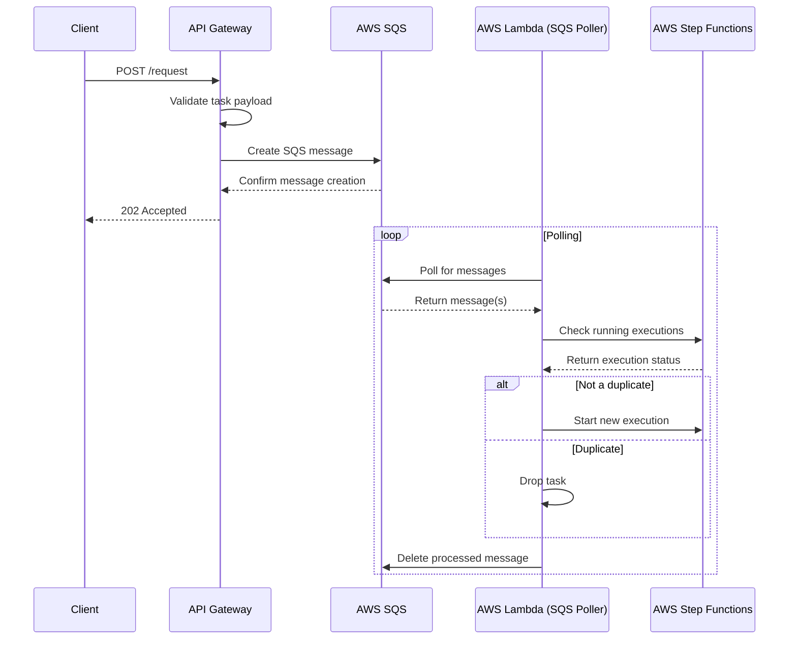
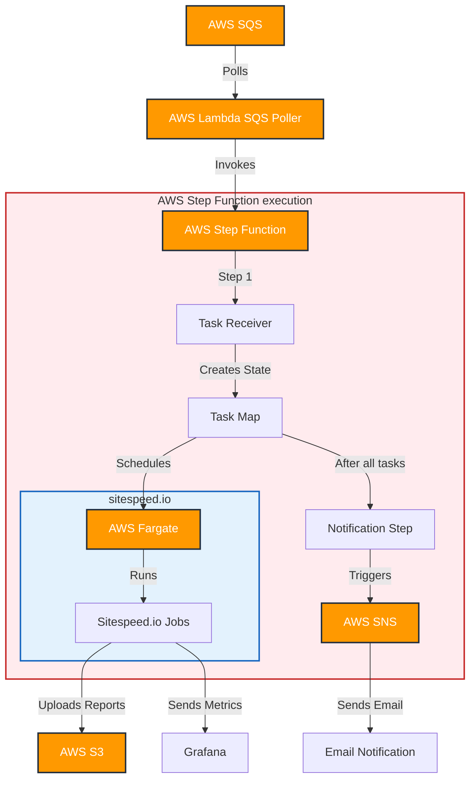

# Web app performance monitoring

## Takeaways

## TL;DR

**Just give me the links!**

### Hosted demo

### GitHub

> [Web app performance monitoring](https://github.com/AlexeyPopovUA/web-app-performance-monitoring)

Here's a breakdown of the flow:

1. The client sends a POST request to the API endpoint (https://task.perf-mon.examples.oleksiipopov.com/request).
2. The API Gateway validates the task payload.
3. If valid, the API creates an SQS message with the task details.
4. The API responds to the client with a 202 Accepted status.
5. An AWS Lambda function, acting as an SQS poller, periodically checks for new messages.
6. When a message is received, the Lambda function checks the running AWS Step Functions executions by their name.
7. If the task is not a duplicate, the Lambda function starts a new Step Functions execution.
8. If the task is a duplicate, the Lambda function drops it.
9. After processing, the Lambda function deletes the message from SQS.

This architecture provides several benefits:

- It decouples the client requests from task processing, allowing for better scalability and resilience.
- It uses API Gateway for initial request handling and validation, improving security and reducing load on backend services.
- It leverages SQS as a buffer to handle traffic spikes and ensure no tasks are lost.
- It prevents duplicate task executions by checking existing Step Functions executions directly.

Here's a detailed explanation of the system components and their interactions:

Task Definition:

* JSON format containing:
  * Short project name
  * Base URL of the web app
  * Environment name
  * Optional git branch or git tag name
  * List of URLs to analyze (with short page names)
  * For each URL: number of iterations and browser list

AWS Lambda (SQS Poller):

* Polls the SQS queue for incoming tasks
* Invokes the AWS Step Function with the task payload

AWS Step Function:

* Task Receiver:
  * Takes the task and creates an AWS Step state
  * Generates all combinations of sample tasks for concurrent execution
* Task Map:
  * Takes an array of subtasks
  * Schedules AWS Fargate instances to run sitespeed.io jobs for each subtask
* Notification Step:
  * Triggered after all tasks are completed
  * Initiates an SNS email notification

AWS Fargate:

* Runs sitespeed.io jobs for each subtask
* Uploads HTML reports to AWS S3
* Sends metrics to Grafana

AWS S3:

* Stores HTML reports in a structured path:
  * /project-name/environment/branch-or-tag/browser/page-name/

Grafana:

* Receives and visualizes performance metrics

AWS SNS:

* Sends email notifications containing:
  * Links to static reports in S3
  * Link to the Grafana dashboard

To implement this solution, you'll need to:

* Set up an AWS SQS queue to receive tasks
* Create an AWS Lambda function to poll the SQS queue
* Design and implement the AWS Step Function with the described steps
* Configure AWS Fargate to run sitespeed.io jobs
* Set up an S3 bucket with appropriate permissions and structure
* Configure Grafana to receive and visualize metrics
* Set up AWS SNS for email notifications
